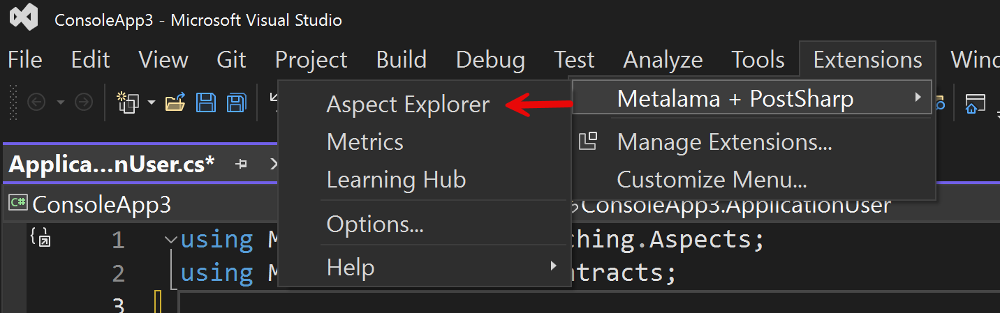
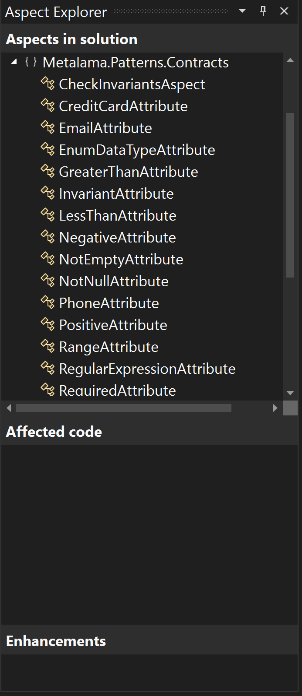

# Did You Install Visual Tools for Metalama

If you use Visual Studio 2022 (any edition), make sure to install the [Visual Tools for Metalama and PostSharp](https://marketplace.visualstudio.com/items?itemName=PostSharpTechnologies.PostSharp). While it's not a prerequisite for using Metalama, it undoubtedly makes the process easier thanks to the features it brings to the IDE.

Primarily, it provides the ability to see how Metalama will affect your code.

The right-click context menu in the editor window offers the option to 'Show Metalama Diff'. This action opens a separate editor window, showing exactly where and what code Metalama will insert at compile time.

For new users of Metalama, this feature is extremely useful as it shows exactly how your code will be altered at compile time. It also assures you that the functionality you require to be added to your code by Metalama is indeed being added.

Once you start creating your own custom Metalama aspects, this feature will prove to be even more beneficial, allowing you to see how your aspects are added to your codebase.

Metalama's extension also features an aspect viewer. This provides a comprehensive oversight of your project and how it an Metalama are interacting. The viewer is accessed vial the extensions menu.

Once open there are three panes within the aspect viewer itself.

The top pane lists all of the aspects that are <b>available</b> to the project. This allows you to see all of the aspects that you could use and as such it also acts as a very easy way to see just what aspects are available within metalama libraries (such as for example the Metalama.Patterns.Contracts library) without having to specifically refer to the documentation.

In the central pane you can see which bit's of your project's code are affected by aspects. To see this pane in action you need to select the aspect that you're interested in in the upper pane first.

> <b> Note that if you are apply aspects to the return value of methods those will not appear in the Affected Code pane.</b>

Another handy feature this extension provides is natural integration with Visual Studio's code lens feature.

In the short clip below, you can see an example of a class that implements an interface in which Metalama aspects have been applied to some properties. It's not immediately apparent that the aspects have been inherited, but upon closer examination, you can see that the code lens feature confirms that this is the case. Invoking the 'Show Metalama Diff' further confirms it.

This tool also provides syntax highlighting of specific Metalama keywords, which is particularly useful when creating your own custom aspects.

> Currently, there are no similar equivalents of this tool for either VSCode or JetBrains' Rider IDE.

The Metalama Tools for Visual Studio 2022 extension is available free of charge. New Metalama users will find the tool provides them with a clear insight into what Metalama actually does. It illustrates just how much standard boilerplate code it is writing on your behalf, saving you time and maintaining the overall clarity of your codebase.

Experienced Metalama users will appreciate both the syntax highlighting and the ability to see how their own custom aspects are likely to interact with other third-party code.
