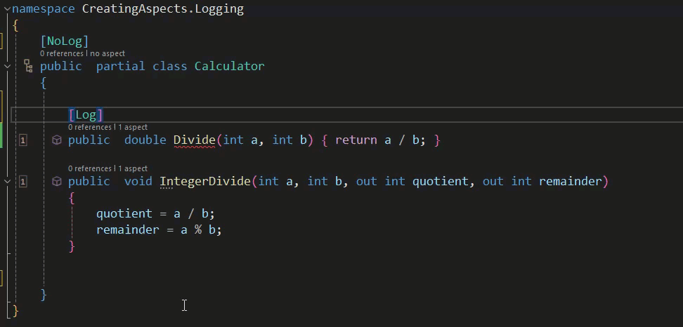

# Creating Aspects: Eligibility and Diagnostics

We have looked at the way that Metalama can be used to create our own sophisticated custom aspects but we have not yet touched on how to ensure that they are not used inappropriately.

Let's reconsider the Log aspect once more. We saw how we could use Metalama's Dependency Injection Extension to make it easy for use to leverage Microsoft's ILogger Interface and we saw how Metalama introduced an appropriate constructor at compile time. However Static classes can't have constructors and whilst Metalama will produce an error message if you were to try and manually add the Log Aspect to a method in a static class the reality with something such as logging, which you'd probably want to apply in a fairly comprehensive fashion, is that you'd use a fabric to apply the attribute. That requires a way to ensure that the aspect is only applied where it is appropriate.

In the code below we have a revised version of our Log aspect. The functionality remains the same but we have introduced some logic to ensure that it only gets applied where it is safe to do so.

```c#
using Metalama.Extensions.DependencyInjection;
using Metalama.Framework.Advising;
using Metalama.Framework.Aspects;
using Metalama.Framework.Code;
using Metalama.Framework.CodeFixes;
using Metalama.Framework.Diagnostics;
using Metalama.Framework.Eligibility;
using Microsoft.Extensions.Logging;

namespace CreatingAspects.Logging
{
    [AttributeUsage(AttributeTargets.Method)]
    public class LogAttribute : Attribute, IAspect<IMethod>
    {
        [IntroduceDependency]
        private readonly ILogger _logger;

        private static DiagnosticDefinition<IMethod> vtl105Error = new(
           "VTL105",
           Severity.Error,
           "This class has already been marked as not requiring logging. Remove the [Log] Aspect");

        public void BuildAspect(IAspectBuilder<IMethod> builder)
        {
            if(builder.Target.DeclaringType.Attributes.OfAttributeType(typeof(NoLogAttribute)).Any())
            {
              if(builder.Target.Attributes.OfAttributeType(typeof(LogAttribute)).Any())
              {
                builder.Diagnostics.Report(vtl105Error.WithArguments(builder.Target));

                builder.Diagnostics.Suggest(
                CodeFixFactory.RemoveAttributes(builder.Target, typeof(LogAttribute), "Remove Aspect | Log"));
              }
              builder.SkipAspect();
            } else
            {
              if(!(builder.Target.Attributes.OfAttributeType(typeof(NoLogAttribute)).Any()))
              {
                 builder.Advice.Override(builder.Target, nameof(this.OverrideMethod));
              } else
              {
                builder.SkipAspect();
              }
            }
        }

        public void BuildEligibility(IEligibilityBuilder<IMethod> builder)
        {
            builder.AddRule(EligibilityRuleFactory.GetAdviceEligibilityRule(AdviceKind.OverrideMethod));
            builder.DeclaringType().MustNotHaveAspectOfType(typeof(NoLogAttribute));
            builder.MustNotBeStatic();
            builder.MustNotHaveAspectOfType(typeof(NoLogAttribute));
        }

        [Template]
        public dynamic? OverrideMethod()
        {
            // Add the code from the previous Log aspect here
        }

        // Add the InterpolatedStringBuilder here
    }


    [AttributeUsage(AttributeTargets.Class | AttributeTargets.Method )]
    public sealed class NoLogAttribute : Attribute
    {
    }

}
```

This aspect will be applied with a Fabric which makes it much simpler to apply widely. That Fabric is reproduced below.

```c#
using Metalama.Framework.Fabrics;

namespace CreatingAspects.Logging
{
    public class ProjectLoggerApplication : ProjectFabric
    {
        public override void AmendProject(IProjectAmender amender)
        {
            amender.Outbound
           .SelectMany(compilation => compilation.AllTypes)
           .Where(type => !type.IsStatic || type.Attributes.OfAttributeType(typeof(NoLogAttribute)).Any())
           .SelectMany(type => type.Methods)
           .Where(method => method.Name != "ToString")
           .AddAspectIfEligible<LogAttribute>();
        }
    }
}
```

The first thing to note is that for the sake of brevity the bulk of the code from our previous example has been omitted allowing us to concentrate on what's been added.

We'll begin with the `BuildAspect` method. This adds some [diagnostics and code fixes](https://doc.postsharp.net/metalama/conceptual/aspects/diagnostics) to the IDE to catch those instances when you might add the `[Log]` attribute manually in an ineligible location (specifically in this case when a class has been marked as one that should not have any members logged).

> This implementation uses a simple `[NoLog]` attribute (reproduced above) that acts as a simple indicator that either a class or method should not have logging applied to it.

Initially a check is made for the presence of the `{NoLog]` on the class itself because clearly is the class shouldn't be logged then there is no point in adding logging. However a diagnostic is there to catch those occasions when the `[Log]` attribute might be added manually and a codefix made available to fix it.

If the class itself can have logging then the individual methods are themselves checked to see that they have not been decorated with the `[NoLog]` attribute and if it's not present calls on the ```OverrideMethod''' template to add the aspect.

Within the Fabric you'll notice that we use `AddAspectIfEligible<>()` and that eligibility is checked in the preceding lines ensuring that the type isn't static (because Dependency Injection requires a constructor), that we're looking at a method and that that method is not a ToString() implementation (in order to avoid potential recursion).

The `BuildEligibility` method is there to ensure that users of your `[Log]` attribute can only apply it in those areas where you have designed it to be applied, see the documentation [here](https://doc.postsharp.net/metalama/conceptual/aspects/eligibility).

Let's now look at how the following class could be affected.

```c#
namespace CreatingAspects.Logging
{

    public  partial class Calculator
    {

        public  double Divide(int a, int b) { return a / b; }

        public  void IntegerDivide(int a, int b, out int quotient, out int remainder)
        {
            quotient = a / b;
            remainder = a % b;
        }

    }
}
```

In this instance everything should be logged and indeed it is with the Fabric applying the log aspect to each method.

```c#

using Microsoft.Extensions.Logging;

namespace CreatingAspects.Logging
{

    public  partial class Calculator
    {

        public  double Divide(int a, int b) {     var isTracingEnabled = this._logger.IsEnabled(LogLevel.Trace);
            if (isTracingEnabled)
            {
                LoggerExtensions.LogTrace(this._logger, $"Calculator.Divide(a = {{{a}}}, b = {{{b}}}) started.");
            }

            try
            {
                double result;
                result = a / b;

                if (isTracingEnabled)
                {
                    LoggerExtensions.LogTrace(this._logger, $"Calculator.Divide(a = {{{a}}}, b = {{{b}}}) returned {result}.");
                }

                return (double)result;
            }
            catch (Exception e) when (this._logger.IsEnabled(LogLevel.Warning))
            {
                LoggerExtensions.LogWarning(this._logger, $"Calculator.Divide(a = {{{a}}}, b = {{{b}}}) failed: {e.Message}");
                throw;
            }
        }

        public  void IntegerDivide(int a, int b, out int quotient, out int remainder)
        {
            var isTracingEnabled = this._logger.IsEnabled(LogLevel.Trace);
            if (isTracingEnabled)
            {
                LoggerExtensions.LogTrace(this._logger, $"Calculator.IntegerDivide(a = {{{a}}}, b = {{{b}}}, quotient = <out> , remainder = <out> ) started.");
            }

            try
            {
                quotient = a / b;
            remainder = a % b;

                object result = null;
                if (isTracingEnabled)
                {
                    LoggerExtensions.LogTrace(this._logger, $"Calculator.IntegerDivide(a = {{{a}}}, b = {{{b}}}, quotient = {{{quotient}}}, remainder = {{{remainder}}}) succeeded.");
                }

                return;
            }
            catch (Exception e) when (this._logger.IsEnabled(LogLevel.Warning))
            {
                LoggerExtensions.LogWarning(this._logger, $"Calculator.IntegerDivide(a = {{{a}}}, b = {{{b}}}, quotient = <out> , remainder = <out> ) failed: {e.Message}");
                throw;
            }
        }


        private ILogger _logger;

        public Calculator
        (ILogger<Calculator> logger = default)
        {
            this._logger = logger ?? throw new System.ArgumentNullException(nameof(logger));

        }
    }
}
```

In the following case nothing should be logged.

```c#
namespace CreatingAspects.Logging
{
    [NoLog]
    public  partial class Calculator
    {
        public  double Divide(int a, int b) { return a / b; }

        public  void IntegerDivide(int a, int b, out int quotient, out int remainder)
        {
            quotient = a / b;
            remainder = a % b;
        }
    }
}
```

As we can see nothing is applied.

```c#
namespace CreatingAspects.Logging
{
    [NoLog]
    public  partial class Calculator
    {
        public  double Divide(int a, int b) { return a / b; }

        public  void IntegerDivide(int a, int b, out int quotient, out int remainder)
        {
            quotient = a / b;
            remainder = a % b;
        }
    }
}
```

In the example below logging should just be applied to the IntegerDivide method.

```c#
namespace CreatingAspects.Logging
{

    public  partial class Calculator
    {

        [NoLog]
        public  double Divide(int a, int b) { return a / b; }

        public  void IntegerDivide(int a, int b, out int quotient, out int remainder)
        {
            quotient = a / b;
            remainder = a % b;
        }
    }
}
```

That is indeed the case.

```c#

using Microsoft.Extensions.Logging;

namespace CreatingAspects.Logging
{

    public  partial class Calculator
    {
        [NoLog]
        public  double Divide(int a, int b) { return a / b; }

        public  void IntegerDivide(int a, int b, out int quotient, out int remainder)
        {
            var isTracingEnabled = this._logger.IsEnabled(LogLevel.Trace);
            if (isTracingEnabled)
            {
                LoggerExtensions.LogTrace(this._logger, $"Calculator.IntegerDivide(a = {{{a}}}, b = {{{b}}}, quotient = <out> , remainder = <out> ) started.");
            }

            try
            {
                quotient = a / b;
            remainder = a % b;

                object result = null;
                if (isTracingEnabled)
                {
                    LoggerExtensions.LogTrace(this._logger, $"Calculator.IntegerDivide(a = {{{a}}}, b = {{{b}}}, quotient = {{{quotient}}}, remainder = {{{remainder}}}) succeeded.");
                }

                return;
            }
            catch (Exception e) when (this._logger.IsEnabled(LogLevel.Warning))
            {
                LoggerExtensions.LogWarning(this._logger, $"Calculator.IntegerDivide(a = {{{a}}}, b = {{{b}}}, quotient = <out> , remainder = <out> ) failed: {e.Message}");
                throw;
            }
        }
    }
}
```

Finally in the last example we should see an error and suggested codefix if the class should not have logging and we try to add the Log aspect manually.



By leveraging the power of Metalama you can build some very powerful custom aspects.

<br>

If you'd like to know more about Metalama in general, visit our [website](https://www.postsharp.net/metalama).

Why not join us on [Slack](https://www.postsharp.net/slack) where you can keep up with what's new and get answers to any technical questions that you might have.
