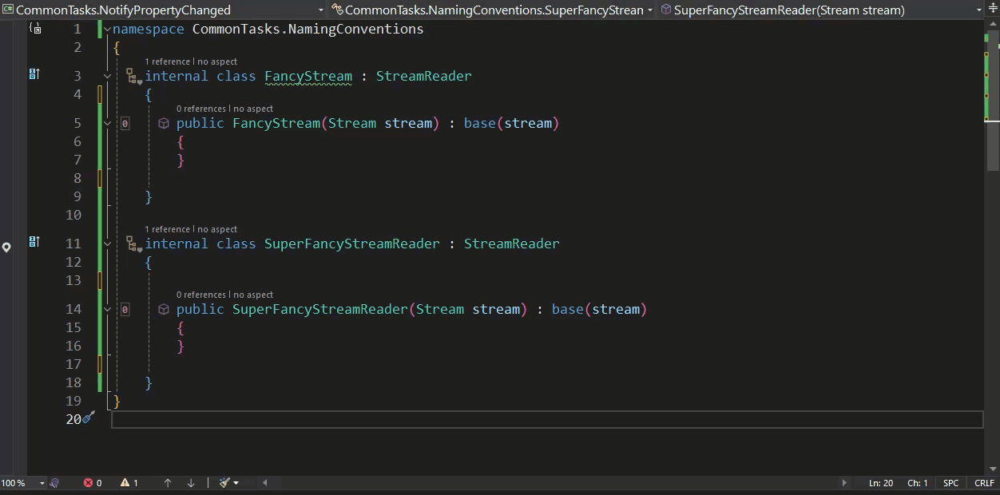

# Common Tasks: Validating Code (Naming Conventions)

In my previous email, I demonstrated how Metalama can generate boilerplate code on-the-fly during compilation, automating the task of implementing necessary but repetitive code. However, code generation is not the only functionality Metalama offers. In this email, I will explore Metalama's second pillar: its ability to validate source code against architectural rules. We'll begin with naming conventions.

Adhering to naming conventions keeps code clean and understandable, whether you're working in a team or independently. It's akin to maintaining a tidy room; it assists everyone, including your future self, in quickly locating what they need without confusion.

You're likely aware that your IDE can already enforce the most basic naming conventions like casing or prefixes. Nowadays, code style can be configured through `.editorconfig`. However, aside from special classes like collections or dictionaries, there is no standard tool to verify the name itself.

Appropriately named types and methods can often communicate their essence and purpose solely through their name. A common rule is that types must have a suffix that indicates what they are.

For instance, consider a situation where an application heavily utilizes stream readers, and there are several classes created by different team members that implement these readers for various tasks. A decision is made to ensure that all such classes have the suffix `StreamReader` added to their names for clarity.

Fabrics, specifically `ProjectFabric`, are an excellent tool to enforce this type of validation as they can cover an entire project.

Let's create a Fabric that checks the codebase to ensure that developers are adhering to the naming convention.

```c#
using Metalama.Extensions.Architecture.Fabrics;
using Metalama.Framework.Fabrics;

internal class NamingConvention : ProjectFabric
{
    public override void AmendProject(IProjectAmender amender)
    {
        amender.Verify().SelectTypesDerivedFrom(typeof(StreamReader)).MustRespectNamingConvention("*Reader");
    }
}
```

In the code above, the fabric examines each class in the project that is derived from `StreamReader`. If the name of any class that matches this criterion does not end in `Reader`, a warning is displayed.

With our custom validation rule written, let's put it to the test. In the code below, we have two classes derived from StreamReader. One has the 'Reader' suffix, the other does not, and as such, it should trigger a warning.

```c#
namespace CommonTasks.NamingConventions
{
    internal class FancyStream : StreamReader
    {
        public FancyStream(Stream stream) : base(stream)
        {
        }
    }


    internal class SuperFancyStreamReader : StreamReader
    {
        public SuperFancyStreamReader(Stream stream) : base(stream)
        {
        }
    }
}
```

We can see our warning in action below.



Although this is a very simple example, it illustrates how Metalama can be used to help validate your codebase and enforce rules. More information about this topic can be found in the [Metalama Documentation](https://doc.postsharp.net/metalama/conceptual/architecture/naming-conventions).
