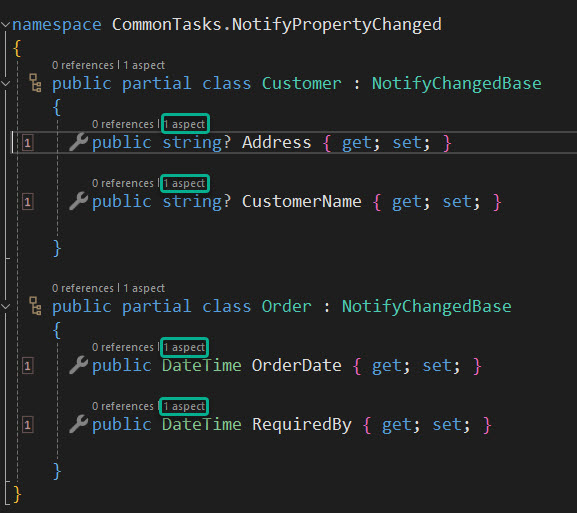

# Using Metalama: Project Fabrics

In previous emails, we used a custom attribute to add aspects to a target class or method. We identified individual methods that needed logging, and added the `[Log]` custom attribute. 

In a real-life application, we might have dozens of classes containing hundreds of methods. To log the application comprehensively, we would have to go through each class separately, adding the `[Log]` attribute to each method. Although this process is substantially faster than adding all the necessary code to each method for logging, it's still quite a task to manually navigate through each class and add the attribute to each method.

Thankfully, Metalama provides a way to automate this process, known as _fabrics_.

In the project, add another class. The name doesn't matter, but it must inherit from `ProjectFabric`.

```c#
using Metalama.Framework.Fabrics;

namespace UsingMetalama.Fabrics
{
    internal class LogDistribution : ProjectFabric
    {
        public override void AmendProject(IProjectAmender amender)
        {
            throw new NotImplementedException();
        }
    }
}
```

From this basic implementation, you can see that this class will amend the current project. Now, let's fill this out so that it actually does something.

```c#
using Metalama.Framework.Fabrics;

namespace UsingMetalama.Fabrics
{
    internal class LogDistribution : ProjectFabric
    {
        public override void AmendProject(IProjectAmender amender)
        {
            amender.Outbound
                .SelectMany(t => t.AllTypes)
                .SelectMany(t => t.Methods)
                .AddAspectIfEligible<LogAttribute>();
        }
    }
}
```

In simple terms, the code we added selects every class in the project, then selects each method in each class. If it's safe, it adds the Log attribute to that method.

Using the Metalama Tools Extension for Visual Studio, we can see how this simple ProjectFabric has worked its magic on our code.




Although this is a simplistic example, it should convey just how powerful Metalama can be and what a time-saver it can prove to be.

We have barely touched on what it's possible to do with Fabrics here. We could apply the log attribute to all of the methods across a solution of projects with the use of a TransitiveFabric.

If we wanted to target a Type or a Namespace, we could do it with either TypeFabric or NamespaceFabric.

Fabrics are not only useful for applying aspects to your code, but they can also be used to implement architecture rules in your codebase.

You can read more about Fabrics [here](https://doc.postsharp.net/metalama/conceptual/using/fabrics). It's one of Metalama's more advanced features, but learning how it works will enable you to do things that previously might have seemed nearly impossible.
