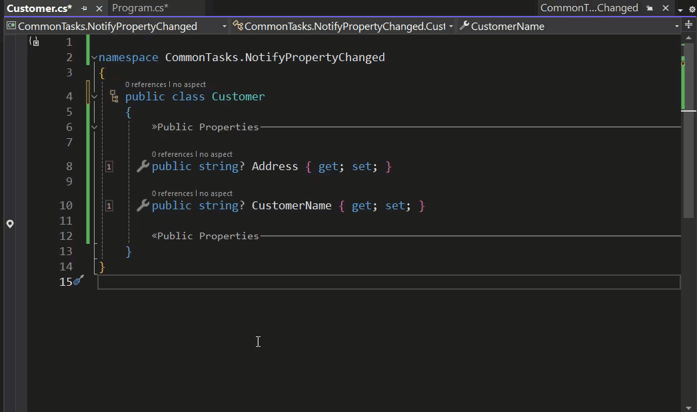

# Common Tasks: INotifyPropertyChanged

We have come to expect application user interfaces to respond almost instantaneously to data that we input into them. This has been made possible by UI's that are built around data bound controls in architecture that implements patterns such as MVVM (Model, View, ViewModel).

In simple language this works because the UI is able to update when properties in the underlying data models change and in so doing raise the PropertyChanged event. This logic is encapsulated in the INotifyPropertyChanged interface. This pattern has been widely adopted because one of the major benefits that it provides is the ability to reuse data models with different Different views.

There is however one very notable drawback to using this interface. It requires a great deal of repetitive boiler plate code and that code is not produced automatically so it's possible to omit parts of it unintentionally.

Dot Net already has an INotifyPropertyChanged Interface so why not just use that. The drawback to that approach is illustrated below.

<br>



<br>

The standard Visual Studio intellisense for this barely does anything. There is still a need to adjust the properties so that they actually raise the event and the event itself needs to be handled.

If Metalama is used to implement INotifyPropertyChanged then all of the additional code required to make this work will be taken care of. It will be necessary to create an aspect to do this but fortunately there is a great example of such an aspect in the [Metalama Documentation](https://doc.postsharp.net/metalama/examples/notifypropertychanged).

```c#
using Metalama.Framework.Aspects;
using Metalama.Framework.Code;
using System.ComponentModel;

namespace CommonTasks.NotifyPropertyChanged
{
    [Inheritable]
    internal class NotifyPropertyChangedAttribute : TypeAspect
    {
        public override void BuildAspect(IAspectBuilder<INamedType> builder)
        {
            builder.Advice.ImplementInterface(builder.Target, typeof(INotifyPropertyChanged), OverrideStrategy.Ignore);

            foreach (var property in builder.Target.Properties.Where(p =>
                         !p.IsAbstract && p.Writeability == Writeability.All))
            {
                builder.Advice.OverrideAccessors(property, null, nameof(this.OverridePropertySetter));
            }
        }

        [InterfaceMember]
        public event PropertyChangedEventHandler? PropertyChanged;

        [Introduce(WhenExists = OverrideStrategy.Ignore)]
        protected void OnPropertyChanged(string name) =>
            this.PropertyChanged?.Invoke(meta.This, new PropertyChangedEventArgs(name));

        [Template]
        private dynamic OverridePropertySetter(dynamic value)
        {
            if (value != meta.Target.Property.Value)
            {
                meta.Proceed();
                this.OnPropertyChanged(meta.Target.Property.Name);
            }

            return value;
        }
    }
}
```

<br>

If you read through the code you should be able to see that it implements the INotifyPropertyChanged interface. Having done that it loops through the properties amending their setters where required to raise the the property changed event and finally it correctly implements the INotifyPropertyChanged interface. With the aspect added to your project The INotifyPropertyChanged implementation is made much simpler.

<br>


<br>

In what was an admittedly small and contrived sample class Metalama successfully implemented the INotifyPropertyChanged interface and in the process saved us having to add 50 additional lines of code. Over the entirety of a larger real world example the savings in writing repetitive boiler plate code will be considerable.

<br>

If you'd like to know more about Metalama in general then visit our [website](https://www.postsharp.net/metalama).

Why not join us on [Slack](https://www.postsharp.net/slack) where you can keep up with what's new and get answers to any technical questions that you might have.
