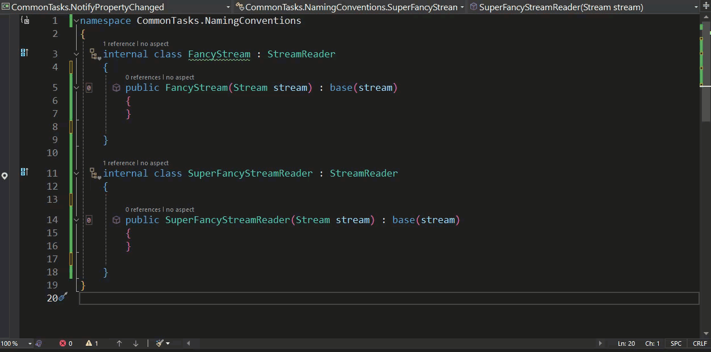

# Common Tasks: Validating Code (Naming Conventions)

Validating naming conventions can be challenging, especially for large teams. However, it's a task that's equally applicable to smaller teams or even individuals working on a large codebase.

Properly named methods can often convey intent or purpose just from their name, so having rules in place to enforce this is not uncommon. The issue usually arises with how these rules are enforced.

For instance, imagine a situation where an application makes extensive use of stream readers, and there are several classes created by different team members that implement these readers to perform various tasks. A decision has been made to ensure that all such classes have the suffix 'StreamReader' added to their names for clarity.

Fabrics, particularly ProjectFabric, are an excellent way to enforce this type of validation as they can cover an entire project.

Let's create a Fabric that checks the codebase to ensure that developers are adhering to the naming convention.

```c#
using Metalama.Extensions.Architecture.Fabrics;
using Metalama.Framework.Fabrics;


    internal class NamingConvention : ProjectFabric
    {


        public override void AmendProject(IProjectAmender amender)
        { amender.Verify().SelectTypesDerivedFrom(typeof(StreamReader)).MustRespectNamingConvention("*Reader"); }


    }
```

In the code above, the fabric examines each class in the project that is derived from `StreamReader`. If the name of any class that matches this criterion does not end in 'Reader', a warning is displayed.

With our custom validation rule written, let's put it to the test. In the code below, we have two classes derived from StreamReader. One has the 'Reader' suffix, the other does not and, as such, it should trigger a warning.

```c#
namespace CommonTasks.NamingConventions
{
    internal class FancyStream : StreamReader
    {


        public FancyStream(Stream stream) : base(stream)
        {
        }


    }


    internal class SuperFancyStreamReader : StreamReader
    {
        public SuperFancyStreamReader(Stream stream) : base(stream)
        {
        }
    }
}
```

We can see our warning in action below.



This is a very simple example, but it illustrates how Metalama can be used to help validate your codebase and enforce rules. More information about this can be found in the [Metalama Documentation](https://doc.postsharp.net/metalama/conceptual/architecture/naming-conventions).

If you'd like to know more about Metalama in general, visit our [website](https://www.postsharp.net/metalama).

Why not join us on [Slack](https://www.postsharp.net/slack) where you can keep up with what's new and get answers to any technical questions you might have?
