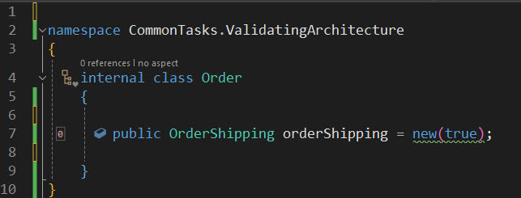
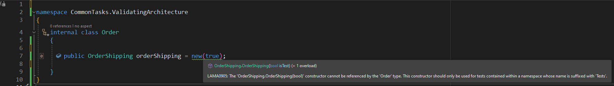
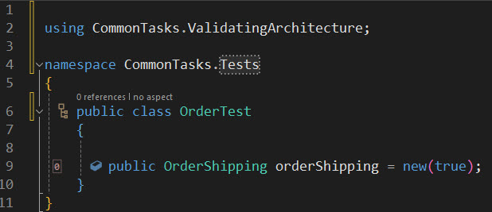
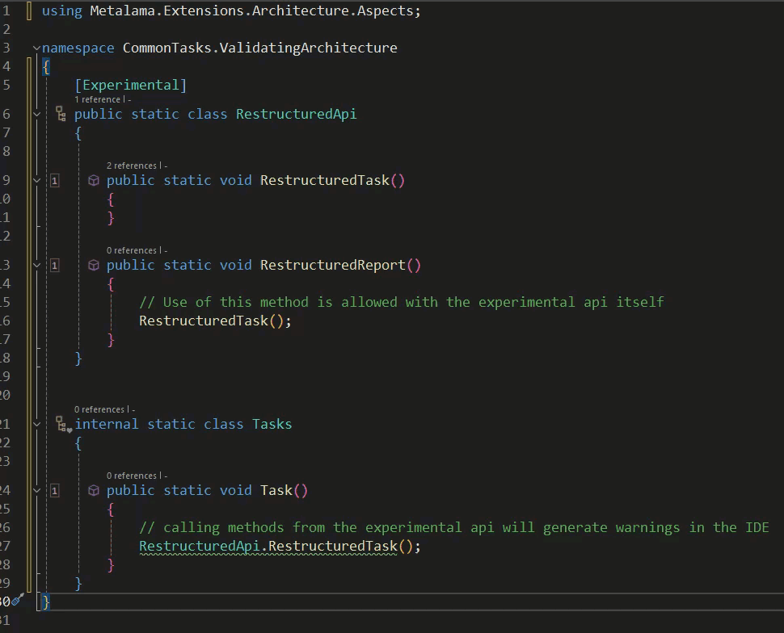

# Common Tasks: Validating Architecture (pre-built aspects)

In order to work together effectively teams of developers need to adhere to rules and conventions to ensure that their individual contributions can integrate seamlessly into the overall application they are all working on.

How can those rules and conventions be enforced? In a very small team working in the same office it could be by word of mouth, or more likely by code review. That can be time consuming and certainly prone to error. It would be much easier if developers could be warned about mistakes or infringements as they write code.

Metalama has a number of pre-made attributes, within the Metalama.Extensions.Architecture Nuget package, that cover many common conventions teams might want to adhere to and of course you can design custom attributes that cover very specific rules that you'd like your team to adhere to. Enforcing rules and conventions this way can;

- Obviate the need for a written set of rules to which everyone must refer.
- Provide immediate feedback to developers within the familiar confines of the IDE itself.
- Improve code reviews as they now only need to focus on the code itself.
- Make the codebase less complex because it adheres to consistent rules.

Let's consider a couple of examples.

In the first we'll take a common premise where certain constructors of a class should only be used for the purpose of testing. Metalama provides the [`[CanOnlyBeUsedFrom()]`](https://doc.postsharp.net/metalama/api/metalama-extensions-architecture-aspects-canonlybeusedfromattribute) attribute for this purpose.

```c#
using Metalama.Extensions.Architecture.Aspects;

namespace CommonTasks.ValidatingArchitecture
{
    public class OrderShipping
    {
        private bool isTest;

        public OrderShipping()
        {
        }

        [CanOnlyBeUsedFrom(Namespaces = new[] {"**.Tests"}, Description = "This constructor should only be used for tests contained within a namespace whose name is suffixed with 'Tests'.")]
        public OrderShipping(bool isTest)
        {
            // Used to trigger specific test configuration
            this.isTest = isTest;

        }
    }
}
```

If we try and create a new OrderShipping instance in a namespace that isn't suffixed by Tests we will see a warning.





Whereas if called correctly from within an allowed namespace we don't.



In our second example we'll look at scenario that large teams working on complex projects may well be familiar with. Teams often create api's to facilitate operations across multiple codebases for which code reviews may well identify issues leading to the development of new ones.

During that development phase having a means to alert other members of the team not directly involved in its development of its current status would be particularly useful. In this case we can make use of the Metalama [`[Experimental]`](https://doc.postsharp.net/metalama/api/metalama-extensions-architecture-aspects-experimentalattribute) attribute.

```c#
using Metalama.Extensions.Architecture.Aspects;

namespace CommonTasks.ValidatingArchitecture
{
    [Experimental]
    public static class RestructuredApi
    {

        public static void RestructuredTask()
        {
        }

        public static void RestructuredReport()
        {
            // Use of this method is allowed with the experimental api itself
            RestructuredTask();
        }
    }


    internal static class Tasks
    {

        public static void Task()
        {
            // calling methods from the experimental api will generate warnings in the IDE
            RestructuredApi.RestructuredTask();
        }
    }
}
```

Within the IDE itself a developer would see the following;



we've just seen two examples of how we can verify our own code using pre built Metalama aspects. You can learn more about those in the documentation [here](https://doc.postsharp.net/metalama/conceptual/architecture/usage), [here](https://doc.postsharp.net/metalama/conceptual/architecture/naming-conventions) and [here](https://doc.postsharp.net/metalama/conceptual/architecture/internal-only-implement).

<br>

If you'd like to know more about Metalama in general, visit our [website](https://www.postsharp.net/metalama).

Why not join us on [Slack](https://www.postsharp.net/slack) where you can keep up with what's new and get answers to any technical questions that you might have.
