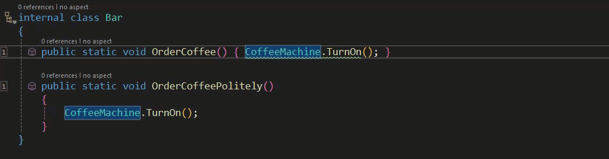

# Common Tasks: Validating Architecture (custom validation)

We've already discussed how Metalama has a number of pre-built aspects that assist with validating the architecture of your codebase. There will be situations where these won't be sufficient and you need to create a custom validation.

Before we look into that it's worth considering whether you could simply extend the use of an existing verification. Some of Metalama's existing verifications can be extended with a custom predicate, making use of the [ReferencePredicateBuilder](https://doc.postsharp.net/metalama/api/metalama-extensions-architecture-predicates-referencepredicatebuilder).

In the extensively commented code below you can see how we can extend existing validation aspects with ReferencePredicates.

```c#
using Metalama.Extensions.Architecture.Fabrics;
using Metalama.Extensions.Architecture.Predicates;
using Metalama.Framework.Aspects;
using Metalama.Framework.Code;
using Metalama.Framework.Fabrics;
using Metalama.Framework.Validation;

namespace CommonTasks.ValidatingArchitecture
{
    /// <summary>   A method name predicate. </summary>
    ///
    /// <remarks> This class actually creates the predicate.  It's designed to
    ///           check method names and see if, in this case, the end with
    ///            a particular word or phrase.   </remarks>
    ///
    /// <seealso cref="T:ReferencePredicate"/>

    internal class MethodNamePredicate : ReferencePredicate
    {
        private readonly string _suffix;

        public MethodNamePredicate(ReferencePredicateBuilder? builder, string suffix) : base(builder)
        { this._suffix = suffix; }

        public override bool IsMatch(in ReferenceValidationContext context)
        {
            return context.ReferencingDeclaration is IMethod method &&
                method.Name.EndsWith(this._suffix, StringComparison.Ordinal);
        }
    }


    /// <summary>   A class to expose your custom extensions. </summary>
    ///
    /// <remarks>   This class could be thought of a form of api for
    ///             your extensions. </remarks>

    [CompileTime]
    public static class Extensions

    {
        public static ReferencePredicate MethodNameEndsWith(this ReferencePredicateBuilder? builder, string suffix) => new MethodNamePredicate(
            builder,
            suffix);
    }


    /// <summary>   A (metalama) fabric. </summary>
    ///
    /// <remarks>  We'll be validating our code with via a ProjectFabric. It will verify
    ///            that methods within a certain type (in this case CoffeeMachine) can
    ///            only be called from methods whose name ends with the word "Politely". </remarks>
    ///
    /// <seealso cref="T:ProjectFabric"/>

    internal class Fabric : ProjectFabric
    {
        public override void AmendProject(IProjectAmender amender)
        { amender.Verify().SelectTypes(typeof(CoffeeMachine)).CanOnlyBeUsedFrom(r => r.MethodNameEndsWith("Politely")); }
    }


    /// <summary>   A coffee machine. </summary>
    ///
    /// <remarks> This is the class whose method(s) we wish to verify  </remarks>

    internal static class CoffeeMachine
    {
        public static void TurnOn()
        {
        }
    }


    /// <summary>   Our test class to verify our new predicate. </summary>
    ///
    /// <remarks>  We have two methods in this class both of which attempt to call
    ///            CoffeeMachine.TurnOn.  As our new predicate verification
    ///            requires that CoffeeMachine.TurnOn should only be called
    ///            from within a method whose name ends with "Politely" we should see
    ///            a warning appear in the OrderCoffee method.  </remarks>

    internal class Bar
    {
        public static void OrderCoffee() { CoffeeMachine.TurnOn(); }

        public static void OrderCoffeePolitely()
        {
            CoffeeMachine.TurnOn();
        }
    }
}
```

You can see that this works in the gif below.



This demonstrates that simply extending the existing verification attributes will provide a number of ways that we can customise verification to our own requirements.

Having looked at extending existing Metalama validation aspects we'll discuss what needs to be taken into consideration when creating custom validation.

Arguably custom validations are one of the most complex things that you can do with Metalama. Before you begin you should ensure that you understand;

- The Aspect Framework and the way it is designed.
- How to report and / or suppress diagnostics.
- How to define the eligibility of aspects.
- How aspects can be applied to derived types.
- The use and role of Fabrics.

Having established the need for a good working knowledge of the Metalama framework the next thing that you'll need to do is whether you'll be requiring the rule to be available as a custom attribute, a compile-time method invoked from a fabric or both. Generally attributes would be used when the requirement is to apply rules one by one. Fabrics would be used to apply to numerous items at once.

Your next decision centres on how the target declaration is being used in your code. What we mean by that is this. Suppose that you want to restrict the areas in which an interface could be implemented. In such cases you'd need to verify references. On the other hand if you were more concerned about how many parameters a method could accept for example then you would need validate types rather than references.

The final decision that needs to be made is whether the validation will be inheritable, in other words derived types are able to inherit it from a base type.

Before you begin creating your own validations you should study both the [Metalama documentation](https://doc.postsharp.net/metalama/conceptual/architecture/extending) and the available source code on [github](https://github.com/postsharp/Metalama.Framework/tree/release/2024.0/Metalama.Framework/Validation).

<br>

If you'd like to know more about Metalama in general, visit our [website](https://www.postsharp.net/metalama).

Why not join us on [Slack](https://www.postsharp.net/slack) where you can keep up with what's new and get answers to any technical questions that you might have.
