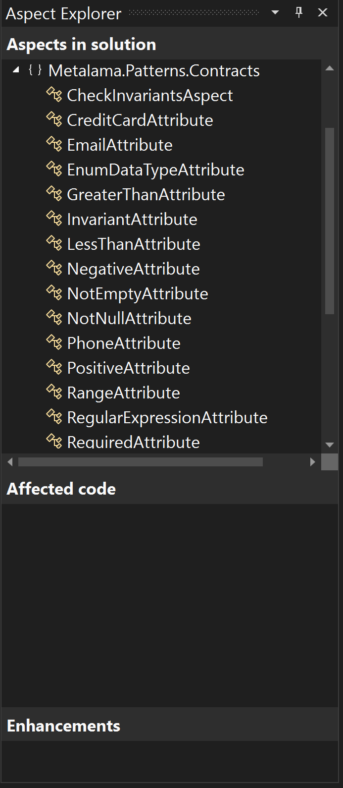

# Using Metalama: The Metalama Tools for Visual Studio Extension

If you use Visual Studio 2022 (any edition) then do make sure that you install the [Metalama Tools Extension](https://marketplace.visualstudio.com/items?itemName=PostSharpTechnologies.Metalama). Whilst it's not a pre-requisite to using Metalama it does undoubtedly make using it that bit easier thanks to the features that it brings to the IDE.

First and foremost amongst the benefits that it confers is the ability to see how Metalama will affect your code.

 

 

The right click context menu in the editor window offers the option to 'Show Metalama Diff'. This brings up a separate editor window that shows you the code that Metalama will add and exactly where it will be added.

For new users of Metalama this is an extremely useful feature in as much as it shows you exactly how your code will be altered at compile time and also assures you that the functionality that you require to be added to your code by Metalama is indeed being added.

Once you start to create your own custom Metalama aspects this feature will prove to be even more beneficial allowing you to see how your own aspects is added to your code base.

Metalama's extension also features an aspect viewer. This provides a comprehensive oversight of your project and how it an Metalama are interacting. The viewer is accessed vial the extensions menu.

Once open there are three panes within the aspect viewer itself.

The top pane lists all of the aspects that are <b>available</b> to the project. This allows you to see all of the aspects that you could use and as such it also acts as a very easy way to see just what aspects are available within metalama libraries (such as for example the Metalama.Patterns.Contracts library) without having to specifically refer to the documentation.

In the central pane you can see which bit's of your project's code are affected by aspects. To see this pane in action you need to select the aspect that you're interested in in the upper pane first.

> <b> Note that if you are apply aspects to the return value of methods those will not appear in the Affected Code pane.</b>

Another really useful feature that this extension provides is natural integration with Visual Studio's code lens feature.

In the short clip below you can see an example of a class that implements an interface in which Metalama aspects have been applied to some properties. It's not immediately apparent that the aspects have in fact been inherited but upon closer examination you can see that the code lens feature does in fact confirm that that is the case and finally invoking the 'Show Metalama Diff' confirms it.

 

 

 

Syntax highlighting of specific Metalama keywords is also provided by this tool which is particularly useful when creating your own custom aspects.

 

> Currently there aren't similar equivalents of this tool for either VSCode of JetBrains' Rider IDE.

 

The Metalama Tools for Visual Studio 2022 extension is available free of charge. New Metalama users will find the tool provides them with a clear insight into what Metalama actually does and it illustrates just how much standard boilerplate code it is writing on your behalf, saving you time and retaining the overall clarity of though in your code base.

Experienced Metalama users will appreciate both the syntax highlighting and been able to see how their own custom aspects are likely to react with other third party code.

 

If you'd like to know more about Metalama in general then visit our [website](https://www.postsharp.net/metalama).

Why not join us on [Slack](https://www.postsharp.net/slack) where you can keep up with what's new and get answers to any technical questions that you might have.
