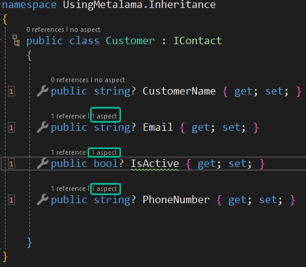

# Using Metalama: Inheritance (via an Interface)

In our emails on common tasks that can be made easier to carry out with Metalama we have shown how adding simple attributes to you code not only saves having to write large amounts of repetitive boilerplate code but leaves your code more compact. The attributes themselves help to clarify the purpose behind the code to anyone reading it.

Clearly adding attributes to the code base is much easier than writing the actual boiler plate code that would be required instead but does this mean that you need to add those attributes to every piece of code where there is a task to be done?

As it turns out the answer to that question is no because Metalama supports inheritance. Let's look at a simple example.

In a typical Line of Business application there may well be classes that represent customers, suppliers and employees. Whilst these classes represent very different aspects of the business they almost certainly have some commonality, an email address, a phone number and some sort of indication that they are important to the business.

That could well lead us to add an interface to our application (itself a type of contract) which could look like this.

```c#
using Metalama.Patterns.Contracts;

namespace UsingMetalama.Inheritance
{
    public interface IContact
    {

        [Email]
        string Email { get; set; }

        [Required]
        bool? IsActive { get; set; }

        [Phone]
        string PhoneNumber { get; set; }

    }
}
```

We could then create a Customer class that implements our IContact interface like so.

```c#
namespace UsingMetalama.Inheritance
{
    public class Customer : IContact
    {

        public string? CustomerName { get; set; }

        public string? Email { get; set; }

        public bool? IsActive { get; set; }

        public string? PhoneNumber { get; set; }


    }
}
```

At this point you might be wondering if the attributes we added to the interface have been carried forward. They have indeed and a screen shot from the IDE itself proves the point.



Notice how each of the properties inherited from the interface show that there is an aspected associated with it and when the code itself comes to be compiled this will be the end result.

<br>

> <b>This Code lens feature is added by Metalama Tools for Visual Studio Extension and is therefore, by definition, only available when using Visual Studio.</b>

 <br>

```c#
using Metalama.Patterns.Contracts;

namespace UsingMetalama.Inheritance
{
    public class Customer : IContact
    {

        public string? CustomerName { get; set; }


        private string? _email;

        public string? Email
{
            get
            {
                return this._email;


            }
            set
            {
                var regex = ContractHelpers.EmailRegex!;
                if (value != null && !regex.IsMatch(value!))
                {
                    var regex_1 = regex;
                    throw new ArgumentException("The 'Email' property must be a valid email address.", "value");
                }
                this._email = value;


            }
        }


        private bool? _isActive;

        public bool? IsActive
{
            get
            {
                return this._isActive;


            }
            set
            {
                if (value == null!)
                {
                    throw new ArgumentNullException("value", "The 'IsActive' property is required.");
                }
                this._isActive = value;


            }
        }


        private string? _phoneNumber;

        public string? PhoneNumber
{
            get
            {
                return this._phoneNumber;


            }
            set
            {
                var regex = ContractHelpers.PhoneRegex!;
                if (value != null && !regex.IsMatch(value!))
                {
                    var regex_1 = regex;
                    throw new ArgumentException("The 'PhoneNumber' property must be a valid phone number.", "value");
                }
                this._phoneNumber = value;


            }
        }


    }
}
```

Metalama has enabled the attributes that enforced specific contracts on your code to be inherited. The Customer class and indeed any other that implements the IContact interface, will remain compact, clean and easy to read but at compile time the functionality that you require will be added. Not only is this saving the necessity to write lots of what is essentially boiler plate code but you can rest assured that it's being done for you in a consistent manner.

<br>

If you'd like to know more about Metalama in general then visit our [website](https://www.postsharp.net/metalama).

Why not join us on [Slack](https://www.postsharp.net/slack) where you can keep up with what's new and get answers to any technical questions that you might have.
