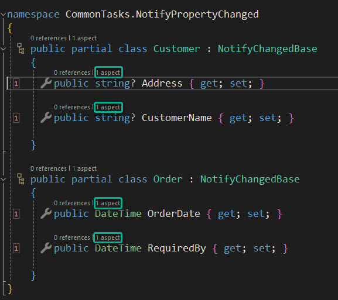

# Using Metalama: Inheritance (via [Inheritable])

We have already discussed the possibility of inheriting aspects via an interface. Another way that we could 'inherit' aspects is to add the `[Inheritable]` aspect to them. If we were, for example, to add an aspect which itself was decorated with the inheritable aspect to a base class the classes that were themselves derived form that base class would inherit that aspect.

When examining how Metalama could be used to make the implementation of INotifyPropertyChanged much easier than it would otherwise be if one were to rely solely of the help provided by intellisense. To do that a Metalama aspect was created specifically. It may have escaped your attention when that was originally discussed but when that aspect was created it was itself decorated with the `[Inheritable]` aspect.

<br>

```c#
  [Inheritable]
  internal class NotifyPropertyChangedAttribute : TypeAspect
  {
    // Aspect code here
  }
```

<br>

By doing this we were able to make sure that the aspect could be passed down to classes that were themselves derived from a class to which the `[NotifyPropertyChanged]` attribute had been added.

This means that it's possible to create a very simple base class;

<br>

```c#
namespace CommonTasks.NotifyPropertyChanged
{
    [NotifyPropertyChanged]
    public  abstract partial class NotifyChangedBase

    {
    }
}
```

<br>

Which can itself be used like this.

<br>



<br>

You can see that the derived classes now have aspects applied to them and if were were to invoke the 'Show Metalama Diff' tool we would see the following;

<br>

```c#

namespace CommonTasks.NotifyPropertyChanged
{
    public partial class Customer : NotifyChangedBase
    {


        private string? _address;
        public string? Address
{
            get
            {
                return this._address;


            }
            set
            {
                if (value != this._address)
                {
                    this._address = value;
                    this.OnPropertyChanged("Address");
                }


            }
        }


        private string? _customerName;

        public string? CustomerName
{
            get
            {
                return this._customerName;


            }
            set
            {
                if (value != this._customerName)
                {
                    this._customerName = value;
                    this.OnPropertyChanged("CustomerName");
                }


            }
        }

    }

    public partial class Order : NotifyChangedBase
    {


        private DateTime _orderDate;
        public DateTime OrderDate
{
            get
            {
                return this._orderDate;


            }
            set
            {
                if (value != this._orderDate)
                {
                    this._orderDate = value;
                    this.OnPropertyChanged("OrderDate");
                }


            }
        }


        private DateTime _requiredBy;

        public DateTime RequiredBy
{
            get
            {
                return this._requiredBy;


            }
            set
            {
                if (value != this._requiredBy)
                {
                    this._requiredBy = value;
                    this.OnPropertyChanged("RequiredBy");
                }


            }
        }

    }
}
```

And in the base class we have the following;

```c#
using System.ComponentModel;

namespace CommonTasks.NotifyPropertyChanged
{
    [NotifyPropertyChanged]
    public  abstract partial class NotifyChangedBase: INotifyPropertyChanged
    {


        protected void OnPropertyChanged(string name)
        {
            this.PropertyChanged?.Invoke(this, new PropertyChangedEventArgs(name));

        }

        public event PropertyChangedEventHandler? PropertyChanged;    }
}
```

<br>

> <b>It should be noted that when using the `[Inheritable]` aspect careful consideration must be given to what might happen in the derived classes should the aspect you are wishing to apply has already been applied.</b>

<br>

Your codebase has remained clean and uncluttered but the intention behind it is apparent. At compile time everything that is needed to implement, in this instance, INotifyPropertyChanged is applied correctly.

<br>

If you'd like to know more about Metalama in general then visit our [website](https://www.postsharp.net/metalama).

Why not join us on [Slack](https://www.postsharp.net/slack) where you can keep up with what's new and get answers to any technical questions that you might have.
