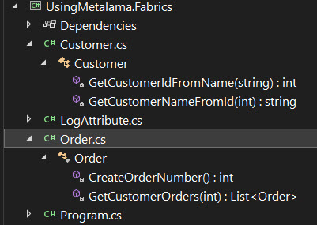
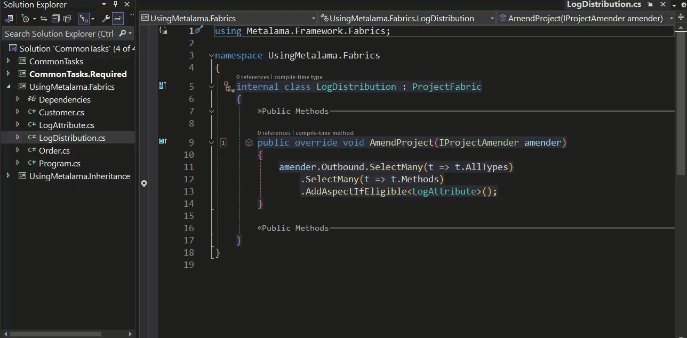

# Using Metalama: Project Fabrics

One way of propagating Metalama aspects across a code base is via inheritance, however inheritance isn't always practical.

A perfect example of this would be Logging. Developers' frequently use logging to help then trace the way that end users interact with their applications and to help diagnose possible errors should they arise.

In the following project solution tree you can see that we have a couple of classes containing methods that we'd like to log with out Logging Aspect.

<br>



<br>

In a real life application we could have dozens of classes containing hundreds of methods and to to log the application comprehensively we would have to go through each class separately adding the `[Log]` attribute to each method.

Whilst that may be substantially faster than adding all the necessary code to each method to do the actual logging itself it still remains quite a task in itself to manually navigate through each class adding the attribute to each method.

Thankfully Metalama has a way to automate that, known as 'Fabrics'.

In the project add another class. The name given to it is immaterial but it must inherit from ProjectFabric.

```c#
using Metalama.Framework.Fabrics;

namespace UsingMetalama.Fabrics
{
    internal class LogDistribution : ProjectFabric
    {
        public override void AmendProject(IProjectAmender amender)
        {
            throw new NotImplementedException();
        }
    }
}
```

From this very basic implementation you can already see that this is going to amend the current project. Now to fill this out so that it actually does something.

```c#
using Metalama.Framework.Fabrics;

namespace UsingMetalama.Fabrics
{
    internal class LogDistribution : ProjectFabric
    {
        public override void AmendProject(IProjectAmender amender)
        {
            amender.Outbound.SelectMany(t => t.AllTypes)
                .SelectMany(t => t.Methods)
                .AddAspectIfEligible<LogAttribute>();
        }
    }
}
```

A basic translation of the code that has just been added is as follows. In the project select every class and in each selected class then select each method. If it's safe to do so add the Log attribute to that method.

Using the Metalama Tools Extension for Visual Studio we can see how this simple ProjectFabric has worked its magic on our code.

<br>



<br>

Although this is indeed a very simplistic example it should none the less convey to you just how powerful Metalama can be and just what a time saver it can prove to be.

We have barely touched upon what it's possible to do with Fabrics here. We could apply the log attribute to all of the methods across an solution of projects with the use of a TransitiveFabric.

If we simply wanted to target a Type or a Namespace it could be done with either TypeFabric or NamespaceFabric.

Nor are Fabrics simply concerned with applying aspects to your code, they can be used to implement architecture rules in your codebase.

You can read more about Fabrics [here](https://doc.postsharp.net/metalama/conceptual/using/fabrics). This is most definitely one of Metalama's more advanced features but learning how it works will enable you to do things that previously might have appeared to be all but impossible.

<br>

If you'd like to know more about Metalama in general then visit our [website](https://www.postsharp.net/metalama).

Why not join us on [Slack](https://www.postsharp.net/slack) where you can keep up with what's new and get answers to any technical questions that you might have.
