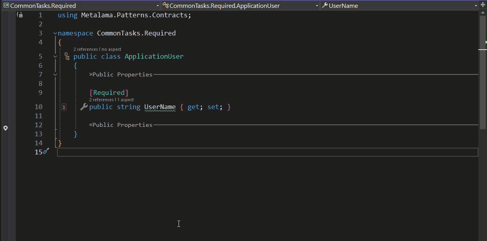
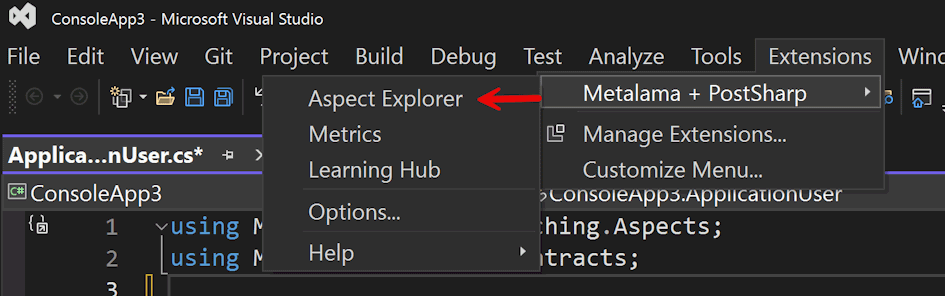
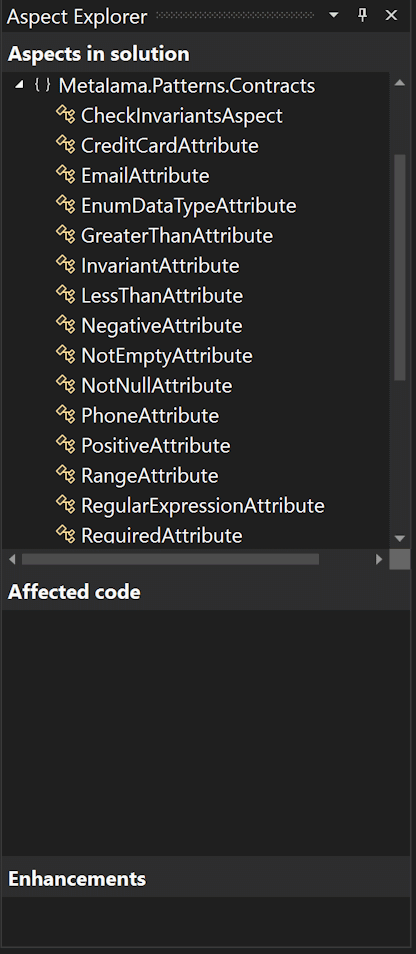

If you are using Visual Studio 2022 (any edition), ensure that you have installed the [Visual Tools for Metalama](https://marketplace.visualstudio.com/items?itemName=PostSharpTechnologies.PostSharp). While not a prerequisite for using Metalama, this tool significantly simplifies the process by offering several useful features in the IDE.

{: .note }
Visual Tools for Metalama are not open source but are **FREE** for individuals, non-commercial use, and companies with up to 3 users under the Metalama Community license.

## Metalama Diff

Primarily, this tool allows you to visualize the impact of Metalama on your code.

The right-click context menu in the editor window provides the _Show Metalama Diff_ option. This command opens a separate editor window, displaying the precise locations and modifications that Metalama will make at compile time.

For new Metalama users, this feature is incredibly helpful as it reveals exactly how your code will be transformed at compile time. It also ensures that the functionality you want Metalama to add to your code is indeed being incorporated.

As you start crafting your custom Metalama aspects, this feature becomes even more advantageous, allowing you to see how your aspects are integrated into your codebase.

## Aspect Explorer

The Metalama extension also includes the Aspect Explorer tool window. It offers a comprehensive overview of your project and its interaction with Metalama. You can access the viewer through the extensions menu.

The Aspect Explorer comprises three panes.

The top pane displays all the aspects that are available to the project. It allows you to see all potential aspects and serves as a straightforward way to explore the available aspects within Metalama libraries (such as the `Metalama.Patterns.Contracts` library) without needing to consult the documentation.

In the central pane, you can identify which parts of your project's code are influenced by aspects. To use this pane, you must first select the aspect of interest in the upper pane.

{: .note }
If you apply aspects to the return value of methods, they will not appear in the Affected Code pane.

## CodeLens

Another useful feature of this extension is its seamless integration with Visual Studio's code lens feature.

In the brief clip below, you'll see a class implementing an interface where Metalama aspects have been applied to some properties. While it's not immediately clear that the aspects have been inherited, a closer look reveals that the code lens feature confirms this. The 'Show Metalama Diff' command further corroborates it.

This tool also offers syntax highlighting for specific Metalama keywords, which is especially beneficial when creating your custom aspects.

{: .note }
Currently, there are no similar equivalents of this tool for either VSCode or JetBrains' Rider IDE.

## Aspect Syntax Highlighting

The Metalama Tools for Visual Studio 2022 extension is available at no cost. New Metalama users will find this tool insightful, as it demonstrates what Metalama does precisely. It shows the amount of standard boilerplate code it writes on your behalf, saving you time and preserving the clarity of your codebase.

Experienced Metalama users will appreciate both the syntax highlighting and the ability to see how their custom aspects are likely to interact with other third-party code.

## Summary

If you are using Visual Studio 2022, don't miss the [Visual Tools for Metalama](https://marketplace.visualstudio.com/items?itemName=PostSharpTechnologies.PostSharp). It offers plenty of features to make your work with Metalama easier.
