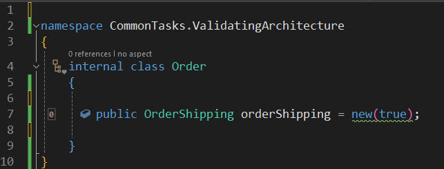
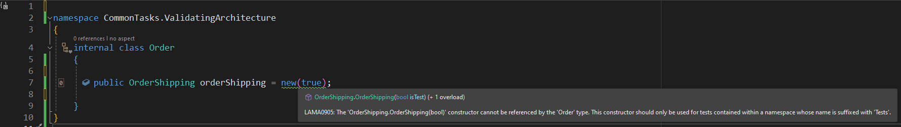
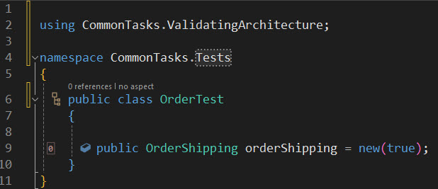

# Validating References

Developers need to adhere to specific rules and conventions to work together effectively as a team. This adherence ensures that individual contributions integrate seamlessly into the overall application.

In a previous email, we discussed how to enforce naming conventions. Today, we will examine how to verify that components are _used_ as expected.

How can these rules and conventions be enforced? In a small team working in the same office, this could be achieved through word of mouth or via code comments such as **DO NOT USE IN PRODUCTION CODE!**, hoping the exclamation mark will help. These rules would then need to be verified during code reviews. Unfortunately, this approach can be time-consuming and prone to errors.

Wouldn't it be more efficient if developers could be warned about errors or infringements as they write code?

The `Metalama.Extensions.Architecture` package offers a number of pre-made custom attributes or compile-time APIs that cover many common conventions that teams might want to follow. Of course, you can also design custom attributes or compile-time APIs that cover very specific rules that you'd like your team to adhere to.

Enforcing rules and conventions in this manner allows you to:

- Eliminate the need for a written set of rules to which everyone must refer.
- Provide immediate feedback to developers within the familiar confines of the IDE itself.
- Improve code reviews as they now only need to focus on the code itself.
- Simplify the codebase because it adheres to consistent rules.

Let's consider a couple of examples.

## Verifying usage with custom attributes

In the first example, we'll take a common premise where certain constructors of a class should only be used for testing. Metalama provides the [CanOnlyBeUsedFrom](https://doc.postsharp.net/etalama/api/metalama-extensions-architecture-aspects-canonlybeusedfromattribute) attribute for this purpose.

In the following example, let's assume we have a constructor that slightly modifies the object's behavior to make it more testable. We want to ensure that this constructor is used only in tests.

```c#
using Metalama.Extensions.Architecture.Aspects;

namespace CommonTasks.ValidatingArchitecture
{
    public class OrderShipping
    {
        private bool isTest;

        public OrderShipping()
        {
        }

        [CanOnlyBeUsedFrom(Namespaces = new[] {"**.Tests"})]
        public OrderShipping(bool isTest)
        {
            // Used to trigger specific test configuration
            this.isTest = isTest;

        }
    }
}
```

If we attempt to create a new `OrderShipping` instance in a namespace that isn't suffixed by `Tests`, we will see a warning.





However, if called correctly from within an allowed namespace, we will not see a warning.



## Verifying whole sets of types or members using fabrics

In the previous example, we had to add a custom attribute to all types or members that we wanted to control. If the same rule applied to many of these declarations, it could be daunting to add a custom attribute to each of them -- and it would defeat Metalama's objective to suppress redundant code.

Enter fabrics.

As we've seen in a previous email, fabrics are compile-time classes that execute within the compiler or the IDE. One of their use cases is to add validation rules.

Let's now consider a second example. Suppose we have a project composed of a large number of components. Each of these components is implemented in its own namespace and is made of several classes. There are so many components that we don't want to have them each in their own project.

However, we still want to isolate components from each other. Specifically, we want `internal` members of each namespace to be only visible within this namespace. Only `public` members should be accessible outside of its home namespace.

Additionally, we want `internal` components to be accessible from any test namespace.

With Metalama, you can validate each namespace by adding the following fabric type:

```cs
 namespace MyComponent
 {
    internal class Fabric : NamespaceFabric
    {
        public override void AmendNamespace( INamespaceAmender amender )
        {
            amender.Verify()
                .InternalsCanOnlyBeUsedFrom( from =>
                    from.CurrentNamespace()
                        .Or( or => or.Type( "**.Tests.**"  )));
        }
    }
 }
```

Now, if some foreign code tries to access an internal API of the `MyComponent` namespace, a warning will be reported.

## Summary

We've just seen two examples of how we can validate our code using pre-built Metalama aspects. You can learn more about these in the documentation [here](https://doc.postsharp.net/metalama/conceptual/architecture/usage), [here](https://doc.postsharp.net/metalama/conceptual/architecture/naming-conventions), and [here](https://doc.postsharp.net/metalama/conceptual/architecture/internal-only-implement).

