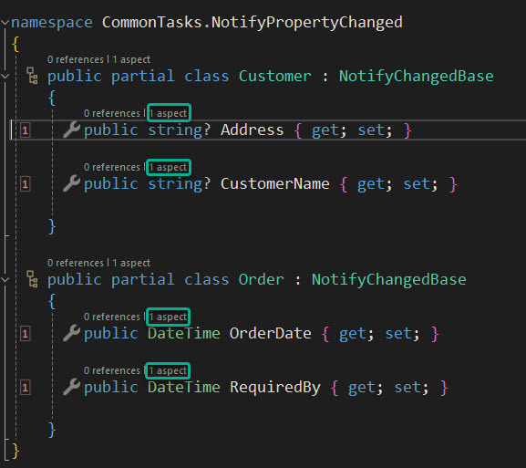

In previous discussions, we used a custom attribute to add aspects to a target class or method. We identified individual methods requiring logging and added the `[Log]` custom attribute.

In a real-world application, you may encounter dozens of classes and hundreds of methods. To achieve comprehensive logging across the application, you would need to go through each class individually, adding the `[Log]` attribute to every method. While this process is far more efficient than manually writing logging code for each method, it is still a significant task to manually traverse each class and add the attribute.

Fortunately, Metalama provides a mechanism to automate this process, known as _fabrics_.

In the project, add a new class. The name of the class is not important, but it must inherit from `ProjectFabric`.

```c#
using Metalama.Framework.Fabrics;

namespace UsingMetalama.Fabrics
{
    internal class LogDistribution : ProjectFabric
    {
        public override void AmendProject(IProjectAmender amender)
        {
            throw new NotImplementedException();
        }
    }
}
```

From this basic implementation, it is clear that this class will modify the current project. Now, let's enhance it to perform a meaningful function.

```c#
using Metalama.Framework.Fabrics;

namespace UsingMetalama.Fabrics
{
    internal class LogDistribution : ProjectFabric
    {
        public override void AmendProject(IProjectAmender amender)
        {
            amender
                .SelectMany(t => t.AllTypes)
                .SelectMany(t => t.Methods)
                .AddAspectIfEligible<LogAttribute>();
        }
    }
}
```

In simple terms, the code above selects every class in the project, then selects each method in each class. If applicable, it adds the `Log` attribute to that method.

Using the Metalama Tools Extension for Visual Studio, you can observe how this simple `ProjectFabric` effectively modifies your code.



Although this is a basic example, it demonstrates the power of Metalama and its potential as a time-saving tool.

We have only scratched the surface of what is possible with fabrics. For example, you could apply the `Log` attribute to all methods across an entire solution of projects using a `TransitiveFabric`.

If you wanted to target a specific type or namespace, you could achieve this with either a `TypeFabric` or a `NamespaceFabric`.

Fabrics are not only useful for adding aspects to your code but can also be used to enforce architectural rules in your codebase.

You can read more about fabrics [here](https://doc.metalama.net/conceptual/using/fabrics). While fabrics are one of Metalama's more advanced features, understanding how they work will enable you to accomplish tasks that might have previously seemed nearly impossible.

