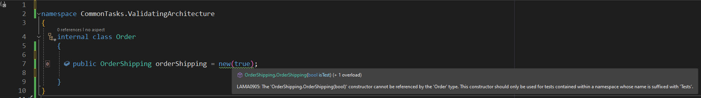
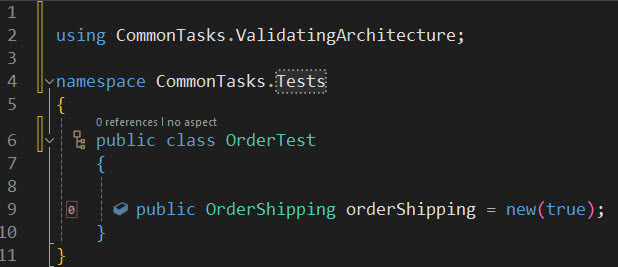

In previous emails, we focused on code generation and aspect-oriented programming. Now, it's time to revisit Metalama's second pillar: architecture validation.

To collaborate effectively as a team, developers must follow specific rules and conventions. But how can these rules and conventions be enforced? In a small team working in the same office, this might be done informally through word of mouth or code comments like **DO NOT USE IN PRODUCTION CODE!**. These rules would then need to be checked during code reviews. Unfortunately, this approach is both time-consuming and error-prone.

Wouldn't it be more efficient if developers were warned about errors or violations as they write code?

The `Metalama.Extensions.Architecture` package provides several pre-made custom attributes and compile-time APIs to enforce common conventions that teams may want to follow. Additionally, you can create custom attributes or compile-time APIs to enforce rules specific to your team's needs.

{: .note }
Architecture validation features, including the `Metalama.Extensions.Architecture` package, are available exclusively in Metalama Professional. These features are not included in the open-source version of Metalama. Our next email will focus on open-source features and use cases.

Enforcing rules and conventions in this way allows you to:

- Eliminate the need for a written set of rules that everyone must reference.
- Provide immediate feedback to developers directly within the IDE.
- Streamline code reviews by focusing solely on the code itself.
- Simplify the codebase by ensuring adherence to consistent rules.

Let's explore a couple of examples.

## Verifying usage with custom attributes

In the first example, we'll address a common scenario where certain constructors of a class should only be used for testing. Metalama provides the [CanOnlyBeUsedFrom](https://doc.postsharp.net/etalama/api/metalama-extensions-architecture-aspects-canonlybeusedfromattribute) attribute for this purpose.

Suppose we have a constructor that slightly modifies an object's behavior to make it more testable. We want to ensure this constructor is used only in tests.

```c#
using Metalama.Extensions.Architecture.Aspects;

public class OrderShipping
{
    private bool isTest;

    public OrderShipping()
    {
    }

    [CanOnlyBeUsedFrom(Namespaces = new[] {"**.Tests"})]
    public OrderShipping(bool isTest)
    {
        // Used to trigger specific test configuration
        this.isTest = isTest;
    }
}
```

If we attempt to create a new `OrderShipping` instance in a namespace that doesn't end with `Tests`, a warning will appear.




However, if the constructor is called correctly from an allowed namespace, no warning will appear.



## Verifying whole sets of types or members using fabrics

In the previous example, we had to add a custom attribute to all types or members we wanted to control. If the same rule applied to many declarations, adding a custom attribute to each one could become tedious and counterproductive to Metalama's goal of reducing redundant code.

This is where fabrics come in.

As discussed in a previous email, fabrics are compile-time classes that execute within the compiler or IDE. One of their use cases is adding validation rules.

Consider a second example. Suppose we have a project with many components, each implemented in its own namespace and consisting of several classes. There are so many components that we don't want to place each in its own project.

However, we still want to isolate components from each other. Specifically, we want `internal` members of each namespace to be visible only within that namespace. Only `public` members should be accessible outside their home namespace.

Additionally, we want `internal` components to be accessible from any test namespace.

With Metalama, you can validate each namespace by adding the following fabric type:

```cs
namespace MyComponent
{
    internal class Fabric : NamespaceFabric
    {
        public override void AmendNamespace(INamespaceAmender amender)
        {
            amender.InternalsCanOnlyBeUsedFrom(from =>
                from.CurrentNamespace().Or(or => or.Type("**.Tests.**")));
        }
    }
}
```

Now, if foreign code tries to access an internal API of the `MyComponent` namespace, a warning will be reported.

## Summary

We've explored two examples of how to validate code using pre-built Metalama aspects. To learn more, refer to the documentation [here](https://doc.metalama.net/conceptual/architecture/usage), [here](https://doc.metalama.net/conceptual/architecture/naming-conventions), and [here](https://doc.metalama.net/conceptual/architecture/internal-only-implement).

