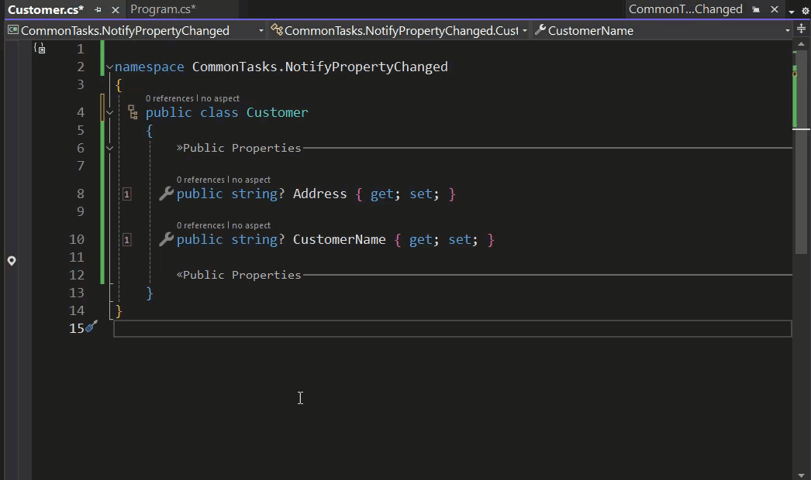

In the previous emails, you learned how to create simple aspects by deriving from `OverrideMethodAspect`. Then, you explored more complex aspects by implementing the `IAspect<T>` interface and its `BuildAspect` method. Today, we will delve into creating aspects that apply _multiple_ modifications to the target code, i.e., provide several pieces of advice. To illustrate this, we will implement the `INotifyPropertyChanged` interface, which requires three distinct operations on the target type and its properties.

## Implementing `INotifyPropertyChanged`

Application user interfaces are designed to respond almost instantaneously to user input. This is achieved through UIs built around data-bound controls in architectures that implement patterns such as MVVM (Model-View-ViewModel). Simply put, the UI updates when properties in the underlying data models change, triggering the `PropertyChanged` event. This behavior is encapsulated in the `INotifyPropertyChanged` interface. This pattern is widely adopted due to its ability to reuse data models across different views.

However, using this interface has a significant drawback: it requires a large amount of repetitive boilerplate code. Since this code is not generated automatically, it is easy to unintentionally omit parts of it.

The .NET class library already includes an `INotifyPropertyChanged` interface, so why not just use that? The drawback of this approach is illustrated below.



The standard Visual Studio _implement interface_ code fix does very little. You still need to adjust the properties to raise the event, and the event itself must be handled manually.

By using Metalama to implement `INotifyPropertyChanged`, all the additional code required to make this work is handled automatically. You will need to create an aspect to achieve this, but fortunately, there is an excellent example of such an aspect in the [Metalama Documentation](https://doc.metalama.net/examples/notifypropertychanged).

```c#
using Metalama.Framework.Aspects;
using Metalama.Framework.Code;
using System.ComponentModel;

[Inheritable]
internal class NotifyPropertyChangedAttribute : TypeAspect
{
    public override void BuildAspect(IAspectBuilder<INamedType> builder)
    {
        builder.ImplementInterface(typeof(INotifyPropertyChanged), OverrideStrategy.Ignore);

        foreach (var property in builder.Target.Properties.Where(p =>
                        !p.IsAbstract && p.Writeability == Writeability.All))
        {
            builder.With(property).OverrideAccessors(null, nameof(this.OverridePropertySetter));
        }
    }

    [InterfaceMember]
    public event PropertyChangedEventHandler? PropertyChanged;

    [Introduce(WhenExists = OverrideStrategy.Ignore)]
    protected void OnPropertyChanged(string name) =>
        this.PropertyChanged?.Invoke(meta.This, new PropertyChangedEventArgs(name));

    [Template]
    private dynamic OverridePropertySetter(dynamic value)
    {
        if (value != meta.Target.Property.Value)
        {
            meta.Proceed();
            this.OnPropertyChanged(meta.Target.Property.Name);
        }

        return value;
    }
}
```

If you examine the implementation of `BuildAspect`, you'll notice the following:

1. It first implements the `INotifyPropertyChanged` interface by calling `builder.Advice.ImplementInterface`. The members of the `INotifyPropertyChanged` interface must be implemented in the aspect class and annotated with the `[InterfaceMember]` attribute.
2. It then iterates through the writable properties, modifying their setters using `builder.Advice.OverrideAccessors` to apply the `OverridePropertySetter` template method.
3. Finally, it adds an `OnPropertyChanged` method to the target type using the `[Introduce]` advice attribute.

With this aspect added to your project, implementing `INotifyPropertyChanged` becomes significantly simpler.


In this small and contrived sample class, Metalama successfully implemented the `INotifyPropertyChanged` interface, saving us from writing 50 additional lines of code. In a larger, real-world project, the reduction in repetitive boilerplate code would be even more substantial.

## Ready-Made Aspect

As demonstrated, automating the implementation of `INotifyPropertyChanged` does not need to be overly complex. However, the aspects we created only handle the most basic cases. For example, we ignored scenarios involving computed properties that depend on the values of multiple other properties. While it is possible to enhance our aspect to handle such cases, doing so would increase its complexity.

Fortunately, Metalama already provides a fully featured solution in the [Metalama.Patterns.Observable](https://doc.metalama.net/patterns/observability) package.

The `[Observable]` aspect supports the following scenarios:
- Automatic properties (as handled by our basic aspect).
- Field-backed and explicitly implemented properties.
- Child objects.
- Child objects in derived types.

For instance, consider the following class, which includes properties dependent on child objects. The `[Observable]` aspect analyzes the code and constructs a dependency graph of properties and fields. This approach allows your code to remain clean and maintainable:

```csharp
[Observable]
public sealed class PersonViewModel
{
    public Person Person { get; set; }

    public string? FirstName => this.Person.FirstName;

    public string? LastName => this.Person.LastName;

    public string FullName => $"{this.FirstName} {this.LastName}";
}
```

For more details about the `[Observable]` aspect, refer to its [documentation](https://doc.metalama.net/patterns/observability).

## Conclusion

Metalama provides you with complete control over code generation, enabling you to automate almost any pattern. For simple patterns, aspects are generally straightforward to implement. You will rarely encounter a scenario that Metalama cannot handle. However, for more complex patterns, it is worth checking whether a prebuilt aspect is already available. We publish these aspects on the [Metalama Marketplace](https://metalama.net/marketplace).