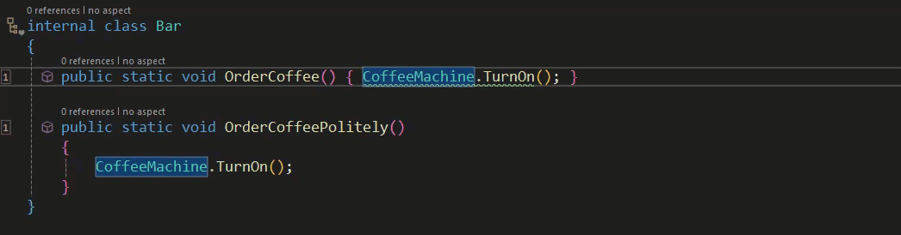

# Common Tasks: Validating Architecture (Custom Validation)

We've already discussed how Metalama provides a number of pre-built aspects to assist with validating the architecture of your codebase. However, there might be scenarios where these pre-built aspects are not sufficient, prompting the need for a custom validation.

Before exploring that, it's worth considering whether you could simply extend the use of an existing verification. Some of Metalama's existing verifications can be extended with a custom predicate, leveraging the [ReferencePredicateBuilder](https://doc.postsharp.net/metalama/api/metalama-extensions-architecture-predicates-referencepredicatebuilder).

The extensively commented code below demonstrates how to extend existing validation aspects with ReferencePredicates.

```c#
using Metalama.Extensions.Architecture.Fabrics;
using Metalama.Extensions.Architecture.Predicates;
using Metalama.Framework.Aspects;
using Metalama.Framework.Code;
using Metalama.Framework.Fabrics;
using Metalama.Framework.Validation;

namespace CommonTasks.ValidatingArchitecture
{
    /// <summary> A method name predicate. </summary>
    ///
    /// <remarks> This class creates the predicate. It's designed to
    ///           check method names and see if, in this case, they end with
    ///           a specific word or phrase. </remarks>
    internal class MethodNamePredicate : ReferencePredicate
    {
        private readonly string _suffix;

        public MethodNamePredicate(ReferencePredicateBuilder? builder, string suffix) : base(builder)
        { this._suffix = suffix; }

        public override bool IsMatch(in ReferenceValidationContext context)
        {
            return context.ReferencingDeclaration is IMethod method &&
                method.Name.EndsWith(this._suffix, StringComparison.Ordinal);
        }
    }


    /// <summary> A class to expose your custom extensions. </summary>
    /// <remarks> This class can be thought of as a form of API for
    ///           your extensions. </remarks>
    [CompileTime]
    public static class Extensions
    {
        public static ReferencePredicate MethodNameEndsWith(this ReferencePredicateBuilder? builder, string suffix) => new MethodNamePredicate(
            builder,
            suffix);
    }


    /// <summary> A (metalama) fabric. </summary>
    /// <remarks> We'll be validating our code with a ProjectFabric. It will verify
    ///           that methods within a certain type (in this case CoffeeMachine) can
    ///           only be called from methods whose name ends with the word "Politely". </remarks>
    /// <seealso cref="T:ProjectFabric"/>
    internal class Fabric : ProjectFabric
    {
        public override void AmendProject(IProjectAmender amender)
        { amender.Verify().SelectTypes(typeof(CoffeeMachine)).CanOnlyBeUsedFrom(r => r.MethodNameEndsWith("Politely")); }
    }


    /// <summary> A coffee machine. </summary>
    /// <remarks> This is the class whose method(s) we wish to verify. </remarks>

    internal static class CoffeeMachine
    {
        public static void TurnOn()
        {
        }
    }


    /// <summary> Our test class to verify our new predicate. </summary>
    ///
    /// <remarks> We have two methods in this class, both of which attempt to call
    ///           CoffeeMachine.TurnOn. As our new predicate verification
    ///           requires that CoffeeMachine.TurnOn should only be called
    ///           from within a method whose name ends with "Politely", we should see
    ///           a warning appear in the OrderCoffee method. </remarks>

    internal class Bar
    {
        public static void OrderCoffee() { CoffeeMachine.TurnOn(); }

        public static void OrderCoffeePolitely()
        {
            CoffeeMachine.TurnOn();
        }
    }
}
```

The functioning of this code extension is demonstrated in the gif below.



This example shows that simply extending the existing verification attributes can provide various ways to customize verification to meet our specific requirements.

Having explored how to extend existing Metalama validation aspects, let's now discuss the considerations when creating custom validation.

Custom validations are arguably among the most complex tasks you can undertake with Metalama. Before you begin, ensure that you understand:

- The Aspect Framework and its design.
- How to report and/or suppress diagnostics.
- How to define the eligibility of aspects.
- How aspects can be applied to derived types.
- The use and role of Fabrics.

After establishing a good working knowledge of the Metalama framework, the next step is to determine whether you'll need the rule to be available as a custom attribute, a compile-time method invoked from a fabric, or both. Generally, attributes are used when the requirement is to apply rules individually, while fabrics are used to apply them to numerous items simultaneously.

Your next decision involves how the target declaration is used in your code. For instance, if you want to restrict the areas where an interface could be implemented, you'd need to verify references. Conversely, if you're concerned about the number of parameters a method could accept, you would need to validate types rather than references.

The final decision to be made is whether the validation will be inheritable, meaning derived types can inherit it from a base type.

Before creating your own validations, we recommend studying both the [Metalama documentation](https://doc.postsharp.net/metalama/conceptual/architecture/extending) and the available source code on [GitHub](https://github.com/postsharp/Metalama.Framework/tree/release/2024.0/Metalama.Framework/Validation).

<br>

If you'd like to learn more about Metalama in general, visit our [website](https://www.postsharp.net/metalama).

Join us on [Slack](https://www.postsharp.net/slack) to stay updated on the latest developments and get answers to any technical questions you may have.
