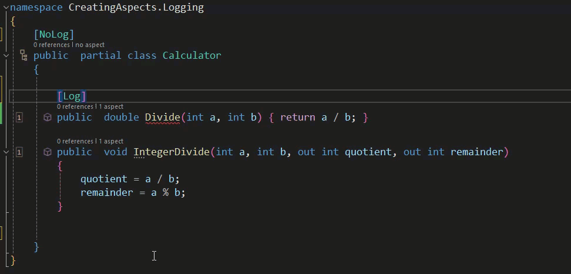

# Creating Aspects: Eligibility and Diagnostics

We've explored how Metalama can be used to create sophisticated custom aspects, but we haven't yet discussed how to ensure they're not used inappropriately.

Let's revisit the Log aspect. We saw how we could leverage Microsoft's ILogger Interface using Metalama's Dependency Injection Extension and how Metalama introduced an appropriate constructor at compile time. However, static classes can't have constructors, and while Metalama will produce an error message if you try to manually add the Log Aspect to a method in a static class, the reality with something like logging—which you'd probably want to apply comprehensively—is that you'd use a fabric to apply the attribute. This requires a way to ensure that the aspect is only applied where it's appropriate.

Below, we have a revised version of our Log aspect. The functionality remains the same, but we've added some logic to ensure that it's only applied where it's safe to do so.

```c#
using Metalama.Extensions.DependencyInjection;
using Metalama.Framework.Advising;
using Metalama.Framework.Aspects;
using Metalama.Framework.Code;
using Metalama.Framework.CodeFixes;
using Metalama.Framework.Diagnostics;
using Metalama.Framework.Eligibility;
using Microsoft.Extensions.Logging;

namespace CreatingAspects.Logging
{
    [AttributeUsage(AttributeTargets.Method)]
    public class LogAttribute : Attribute, IAspect<IMethod>
    {
        [IntroduceDependency]
        private readonly ILogger _logger;

        private static DiagnosticDefinition<IMethod> vtl105Error = new(
           "VTL105",
           Severity.Error,
           "This class has already been marked as not requiring logging. Remove the [Log] Aspect");

        public void BuildAspect(IAspectBuilder<IMethod> builder)
        {
            if(builder.Target.DeclaringType.Attributes.OfAttributeType(typeof(NoLogAttribute)).Any())
            {
              if(builder.Target.Attributes.OfAttributeType(typeof(LogAttribute)).Any())
              {
                builder.Diagnostics.Report(vtl105Error.WithArguments(builder.Target));

                builder.Diagnostics.Suggest(
                CodeFixFactory.RemoveAttributes(builder.Target, typeof(LogAttribute), "Remove Aspect | Log"));
              }
              builder.SkipAspect();
            } else
            {
              if(!(builder.Target.Attributes.OfAttributeType(typeof(NoLogAttribute)).Any()))
              {
                 builder.Advice.Override(builder.Target, nameof(this.OverrideMethod));
              } else
              {
                builder.SkipAspect();
              }
            }
        }

        public void BuildEligibility(IEligibilityBuilder<IMethod> builder)
        {
            builder.AddRule(EligibilityRuleFactory.GetAdviceEligibilityRule(AdviceKind.OverrideMethod));
            builder.DeclaringType().MustNotHaveAspectOfType(typeof(NoLogAttribute));
            builder.MustNotBeStatic();
            builder.MustNotHaveAspectOfType(typeof(NoLogAttribute));
        }

        [Template]
        public dynamic? OverrideMethod()
        {
            // Add the code from the previous Log aspect here
        }

        // Add the InterpolatedStringBuilder here
    }


    [AttributeUsage(AttributeTargets.Class | AttributeTargets.Method )]
    public sealed class NoLogAttribute : Attribute
    {
    }

}
```

This aspect will be applied with a Fabric, which simplifies its widespread application. That Fabric is reproduced below.

```c#
using Metalama.Framework.Fabrics;

namespace CreatingAspects.Logging
{
    public class ProjectLoggerApplication : ProjectFabric
    {
        public override void AmendProject(IProjectAmender amender)
        {
            amender.Outbound
           .SelectMany(compilation => compilation.AllTypes)
           .Where(type => !type.IsStatic || type.Attributes.OfAttributeType(typeof(NoLogAttribute)).Any())
           .SelectMany(type => type.Methods)
           .Where(method => method.Name != "ToString")
           .AddAspectIfEligible<LogAttribute>();
        }
    }
}
```

For the sake of brevity, we've omitted the bulk of the code from our previous example to focus on what's been added.

Let's start with the `BuildAspect` method. This method adds some [diagnostics and code fixes](https://doc.postsharp.net/metalama/conceptual/aspects/diagnostics) to the IDE to catch instances when you might manually add the `[Log]` attribute in an ineligible location—specifically when a class has been marked as one that should not have any members logged.

> This implementation uses a simple `[NoLog]` attribute (reproduced above) that indicates that either a class or method should not have logging applied to it.

Initially, a check is made for the presence of the `{NoLog]` on the class itself. If the class shouldn't be logged, then there's no point in adding logging. However, a diagnostic is there to catch occasions when the `[Log]` attribute might be manually added, and a codefix is available to fix it.

If the class itself can have logging, then the individual methods are checked to see if they've been decorated with the `[NoLog]` attribute. If it's not present, the `OverrideMethod` template is called to add the aspect.

Within the Fabric, you'll notice that we use `AddAspectIfEligible<>()`. The eligibility is checked in the preceding lines, ensuring that the type isn't static (because Dependency Injection requires a constructor), that we're looking at a method, and that the method is not a ToString() implementation (to avoid potential recursion).

The `BuildEligibility` method ensures that users of your `[Log]` attribute can only apply it in areas where you've designed it to be applied. See the documentation [here](https://doc.postsharp.net/metalama/conceptual/aspects/eligibility).

Let's now look at how the following class could be affected.

```c#
namespace CreatingAspects.Logging
{

    public  partial class Calculator
    {

        public  double Divide(int a, int b) { return a / b; }

        public  void IntegerDivide(int a, int b, out int quotient, out int remainder)
        {
            quotient = a / b;
            remainder = a % b;
        }

    }
}
```

In this instance, everything should be logged, and indeed it is, with the Fabric applying the log aspect to each method.

```c#

using Microsoft.Extensions.Logging;

namespace CreatingAspects.Logging
{

    public  partial class Calculator
    {

        public  double Divide(int a, int b) {     var isTracingEnabled = this._logger.IsEnabled(LogLevel.Trace);
            if (isTracingEnabled)
            {
                LoggerExtensions.LogTrace(this._logger, $"Calculator.Divide(a = {{{a}}}, b = {{{b}}}) started.");
            }

            try
            {
                double result;
                result = a / b;

                if (isTracingEnabled)
```csharp
{
    LoggerExtensions.LogTrace(this._logger, $"Calculator.Divide(a = {{{a}}}, b = {{{b}}}) returned {result}.");
}

return (double)result;
}
catch (Exception e) when (this._logger.IsEnabled(LogLevel.Warning))
{
    LoggerExtensions.LogWarning(this._logger, $"Calculator.Divide(a = {{{a}}}, b = {{{b}}}) failed: {e.Message}");
    throw;
}
}

public void IntegerDivide(int a, int b, out int quotient, out int remainder)
{
    var isTracingEnabled = this._logger.IsEnabled(LogLevel.Trace);
    if (isTracingEnabled)
    {
        LoggerExtensions.LogTrace(this._logger, $"Calculator.IntegerDivide(a = {{{a}}}, b = {{{b}}}, quotient = <out>, remainder = <out>) started.");
    }

    try
    {
        quotient = a / b;
        remainder = a % b;

        object result = null;
        if (isTracingEnabled)
        {
            LoggerExtensions.LogTrace(this._logger, $"Calculator.IntegerDivide(a = {{{a}}}, b = {{{b}}}, quotient = {{{quotient}}}, remainder = {{{remainder}}}) succeeded.");
        }

        return;
    }
    catch (Exception e) when (this._logger.IsEnabled(LogLevel.Warning))
    {
        LoggerExtensions.LogWarning(this._logger, $"Calculator.IntegerDivide(a = {{{a}}}, b = {{{b}}}, quotient = <out>, remainder = <out>) failed: {e.Message}");
        throw;
    }
}


private ILogger _logger;

public Calculator
(ILogger<Calculator> logger = default)
{
    this._logger = logger ?? throw new System.ArgumentNullException(nameof(logger));
}
}
}
```

In the following case, no logs should be generated.

```csharp
namespace CreatingAspects.Logging
{
    [NoLog]
    public partial class Calculator
    {
        public double Divide(int a, int b) { return a / b; }

        public void IntegerDivide(int a, int b, out int quotient, out int remainder)
        {
            quotient = a / b;
            remainder = a % b;
        }
    }
}
```

As demonstrated, no logs are generated.

```csharp
namespace CreatingAspects.Logging
{
    [NoLog]
    public partial class Calculator
    {
        public double Divide(int a, int b) { return a / b; }

        public void IntegerDivide(int a, int b, out int quotient, out int remainder)
        {
            quotient = a / b;
            remainder = a % b;
        }
    }
}
```

In the example below, logging should only be applied to the `IntegerDivide` method.

```csharp
namespace CreatingAspects.Logging
{
    public partial class Calculator
    {
        [NoLog]
        public double Divide(int a, int b) { return a / b; }

        public void IntegerDivide(int a, int b, out int quotient, out int remainder)
        {
            quotient = a / b;
            remainder = a % b;
        }
    }
}
```

As expected, logging is only applied to the `IntegerDivide` method.

```csharp
using Microsoft.Extensions.Logging;

namespace CreatingAspects.Logging
{
    public partial class Calculator
    {
        [NoLog]
        public double Divide(int a, int b) { return a / b; }

        public void IntegerDivide(int a, int b, out int quotient, out int remainder)
        {
            var isTracingEnabled = this._logger.IsEnabled(LogLevel.Trace);
            if (isTracingEnabled)
            {
                LoggerExtensions.LogTrace(this._logger, $"Calculator.IntegerDivide(a = {{{a}}}, b = {{{b}}}, quotient = <out>, remainder = <out>) started.");
            }

            try
            {
                quotient = a / b;
                remainder = a % b;

                object result = null;
                if (isTracingEnabled)
                {
                    LoggerExtensions.LogTrace(this._logger, $"Calculator.IntegerDivide(a = {{{a}}}, b = {{{b}}}, quotient = {{{quotient}}}, remainder = {{{remainder}}}) succeeded.");
                }

                return;
            }
            catch (Exception e) when (this._logger.IsEnabled(LogLevel.Warning))
            {
                LoggerExtensions.LogWarning(this._logger, $"Calculator.IntegerDivide(a = {{{a}}}, b = {{{b}}}, quotient = <out>, remainder = <out>) failed: {e.Message}");
                throw;
            }
        }
    }
}
```
```
}
}
```

In the final example, an error and a suggested code fix should be observed if an attempt is made to manually add the Log aspect to a class that should not have logging.



By leveraging the capabilities of Metalama, powerful custom aspects can be developed.

For more information about Metalama, please visit our [website](https://www.postsharp.net/metalama).

We also encourage you to join us on [Slack](https://www.postsharp.net/slack), where you can stay updated on our latest developments and get answers to your technical questions.
