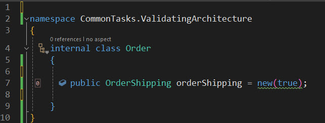

# Common Tasks: Validating Architecture (Pre-built Aspects)

Developers need to adhere to specific rules and conventions to work together effectively as a team. This adherence ensures that individual contributions integrate seamlessly into the overall application.

How can these rules and conventions be enforced? In a small team working in the same office, it could be through word of mouth or code review. However, this approach can be time-consuming and prone to errors. It would be more efficient if developers could be warned about mistakes or infringements as they write code.

Metalama offers a number of pre-made attributes, available in the `Metalama.Extensions.Architecture` Nuget package, that cover many common conventions that teams might want to follow. Of course, you can also design custom attributes that cover very specific rules that you'd like your team to adhere to. Enforcing rules and conventions in this way allows you to:

- Eliminate the need for a written set of rules to which everyone must refer.
- Provide immediate feedback to developers within the familiar confines of the IDE itself.
- Improve code reviews as they now only need to focus on the code itself.
- Simplify the codebase because it adheres to consistent rules.

Let's consider a couple of examples.

In the first example, we'll take a common premise where certain constructors of a class should only be used for testing. Metalama provides the [`[CanOnlyBeUsedFrom()]`](https://doc.postsharp.net/metalama/api/metalama-extensions-architecture-aspects-canonlybeusedfromattribute) attribute for this purpose.

```c#
using Metalama.Extensions.Architecture.Aspects;

namespace CommonTasks.ValidatingArchitecture
{
    public class OrderShipping
    {
        private bool isTest;

        public OrderShipping()
        {
        }

        [CanOnlyBeUsedFrom(Namespaces = new[] {"**.Tests"}, Description = "This constructor should only be used for tests contained within a namespace whose name is suffixed with 'Tests'.")]
        public OrderShipping(bool isTest)
        {
            // Used to trigger specific test configuration
            this.isTest = isTest;

        }
    }
}
```

If we attempt to create a new `OrderShipping` instance in a namespace that isn't suffixed by `Tests`, we will see a warning.




However, if called correctly from within an allowed namespace, we will not see a warning.


In our second example, we'll look at a scenario that large teams working on complex projects may be familiar with. Teams often create APIs to facilitate operations across multiple codebases. Code reviews may identify issues leading to the development of new APIs.

During the development phase, having a means to alert other team members not directly involved in its development of its current status would be beneficial. In this case, we can use the Metalama [`[Experimental]`](https://doc.postsharp.net/metalama/api/metalama-extensions-architecture-aspects-experimentalattribute) attribute.

```c#
using Metalama.Extensions.Architecture.Aspects;

namespace CommonTasks.ValidatingArchitecture
{
    [Experimental]
    public static class RestructuredApi
    {

        public static void RestructuredTask()
        {
        }

        public static void RestructuredReport()
        {
            // Use of this method is allowed with the experimental api itself
            RestructuredTask();
        }
    }


    internal static class Tasks
    {

        public static void Task()
        {
            // calling methods from the experimental api will generate warnings in the IDE
            RestructuredApi.RestructuredTask();
        }
    }
}
```

Within the IDE, a developer would see the following:


We've just seen two examples of how we can validate our code using pre-built Metalama aspects. You can learn more about these in the documentation [here](https://doc.postsharp.net/metalama/conceptual/architecture/usage), [here](https://doc.postsharp.net/metalama/conceptual/architecture/naming-conventions), and [here](https://doc.postsharp.net/metalama/conceptual/architecture/internal-only-implement).

