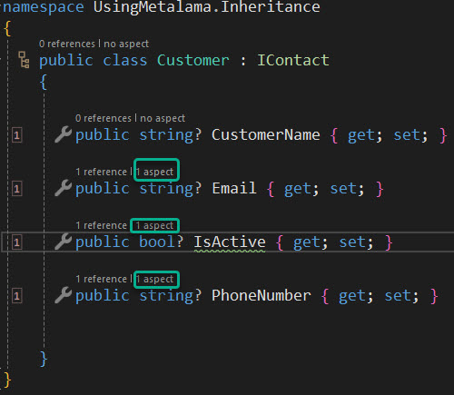

subject: "Using Metalama: Inheritance (via an Interface)"
---
---

In our previous discussions about common tasks that can be simplified with Metalama, we demonstrated how adding simple attributes to your code can eliminate the need for writing large amounts of repetitive boilerplate code. This makes your code more compact and clarifies its purpose to any reader.

You might wonder if adding attributes to the code base is less cumbersome than writing the actual boilerplate code that would otherwise be required. Does this mean you need to add these attributes to every piece of code where a task needs to be performed?

The answer is no, thanks to Metalama's support for inheritance. Let's consider a simple example.

In a typical Line of Business application, there might be classes representing customers, suppliers, and employees. Although these classes represent different aspects of the business, they likely share some commonalities, such as an email address, a phone number, and some indication of their importance to the business.

This could lead us to introduce an interface to our application (which is, in itself, a type of contract) that could look like this:

```c#
using Metalama.Patterns.Contracts;

namespace UsingMetalama.Inheritance
{
    public interface IContact
    {

        [Email]
        string Email { get; set; }

        [Required]
        bool? IsActive { get; set; }

        [Phone]
        string PhoneNumber { get; set; }

    }
}
```

We could then create a Customer class that implements our IContact interface like this:

```c#
namespace UsingMetalama.Inheritance
{
    public class Customer : IContact
    {

        public string? CustomerName { get; set; }

        public string? Email { get; set; }

        public bool? IsActive { get; set; }

        public string? PhoneNumber { get; set; }


    }
}
```

At this point, you might be wondering if the attributes we added to the interface have been carried forward. They have indeed, and a screenshot from the IDE itself proves the point.



Notice how each of the properties inherited from the interface indicates that there is an aspect associated with it. When the code itself is compiled, this will be the final result.

> <b>The Code lens feature is added by the Metalama Tools for Visual Studio Extension and is, by definition, only available when using Visual Studio.</b>

```c#
using Metalama.Patterns.Contracts;

namespace UsingMetalama.Inheritance
{
    public class Customer : IContact
    {

        public string? CustomerName { get; set; }


        private string? _email;

        public string? Email
        {
            get
            {
                return this._email;


            }
            set
            {
                var regex = ContractHelpers.EmailRegex!;
                if (value != null && !regex.IsMatch(value!))
                {
                    var regex_1 = regex;
                    throw new ArgumentException("The 'Email' property must be a valid email address.", "value");
                }
                this._email = value;


            }
        }


        private bool? _isActive;

        public bool? IsActive
        {
            get
            {
                return this._isActive;


            }
            set
            {
                if (value == null!)
                {
                    throw new ArgumentNullException("value", "The 'IsActive' property is required.");
                }
                this._isActive = value;


            }
        }


        private string? _phoneNumber;

        public string? PhoneNumber
        {
            get
            {
                return this._phoneNumber;


            }
            set
            {
                var regex = ContractHelpers.PhoneRegex!;
                if (value != null && !regex.IsMatch(value!))
                {
                    var regex_1 = regex;
                    throw new ArgumentException("The 'PhoneNumber' property must be a valid phone number.", "value");
                }
                this._phoneNumber = value;


            }
        }


    }
}
```

Metalama automatically propagated contract attributes from the base class to the derived class. The `Customer` class, and indeed any other class that implements the `IContact` interface, will remain compact, clean, and easy to read. However, at compile time, the required functionality will be added. This not only saves you from writing a substantial amount of boilerplate code, but also ensures that it's done consistently for you.
