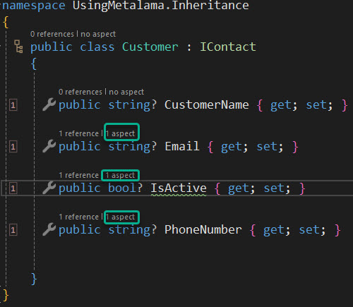

# Using Metalama: Inheritance (via an Interface)

In our emails about common tasks that can be simplified with Metalama, we've demonstrated how adding simple attributes to your code can save you from writing large amounts of repetitive boilerplate code, leaving your code more compact. These attributes also help clarify the purpose of the code to anyone reading it.

You might wonder if adding attributes to the code base is easier than writing the actual boilerplate code that would be required instead. Does this mean that you need to add those attributes to every piece of code where a task needs to be done?

The answer to that question is no, because Metalama supports inheritance. Let's look at a simple example.

In a typical Line of Business application, there may be classes that represent customers, suppliers, and employees. While these classes represent very different aspects of the business, they almost certainly have some commonalities, such as an email address, a phone number, and some sort of indication that they are important to the business.

This could lead us to add an interface to our application (which is itself a type of contract) that could look like this:

```c#
using Metalama.Patterns.Contracts;

namespace UsingMetalama.Inheritance
{
    public interface IContact
    {

        [Email]
        string Email { get; set; }

        [Required]
        bool? IsActive { get; set; }

        [Phone]
        string PhoneNumber { get; set; }

    }
}
```

We could then create a Customer class that implements our IContact interface like this:

```c#
namespace UsingMetalama.Inheritance
{
    public class Customer : IContact
    {

        public string? CustomerName { get; set; }

        public string? Email { get; set; }

        public bool? IsActive { get; set; }

        public string? PhoneNumber { get; set; }


    }
}
```

At this point, you might be wondering if the attributes we added to the interface have been carried forward. They indeed have, and a screenshot from the IDE itself proves the point.



Notice how each of the properties inherited from the interface shows that there is an aspect associated with it, and when the code itself is compiled, this will be the end result.


> <b>The Code lens feature is added by the Metalama Tools for Visual Studio Extension and is, by definition, only available when using Visual Studio.</b>

 
```c#
using Metalama.Patterns.Contracts;

namespace UsingMetalama.Inheritance
{
    public class Customer : IContact
    {

        public string? CustomerName { get; set; }


        private string? _email;

        public string? Email
{
            get
            {
                return this._email;


            }
            set
            {
                var regex = ContractHelpers.EmailRegex!;
                if (value != null && !regex.IsMatch(value!))
                {
                    var regex_1 = regex;
                    throw new ArgumentException("The 'Email' property must be a valid email address.", "value");
                }
                this._email = value;


            }
        }


        private bool? _isActive;

        public bool? IsActive
{
            get
            {
                return this._isActive;


            }
            set
            {
                if (value == null!)
                {
                    throw new ArgumentNullException("value", "The 'IsActive' property is required.");
                }
                this._isActive = value;


            }
        }


        private string? _phoneNumber;

        public string? PhoneNumber
{
            get
            {
                return this._phoneNumber;


            }
            set
            {
                var regex = ContractHelpers.PhoneRegex!;
                if (value != null && !regex.IsMatch(value!))
                {
                    var regex_1 = regex;
                    throw new ArgumentException("The 'PhoneNumber' property must be a valid phone number.", "value");
                }
                this._phoneNumber = value;


            }
        }


    }
}
```

Metalama has enabled the attributes that enforced specific contracts on your code to be inherited. The Customer class, and indeed any other class that implements the IContact interface, will remain compact, clean, and easy to read. However, at compile time, the functionality that you require will be added. Not only does this save you from writing lots of what is essentially boilerplate code, but you can rest assured that it's being done for you consistently.
